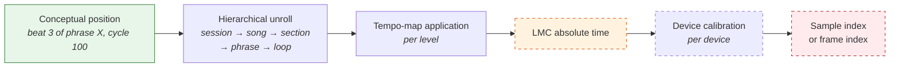
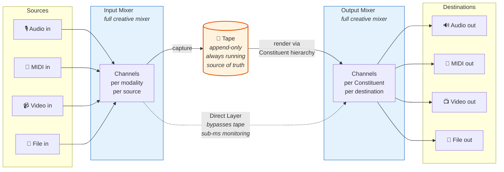
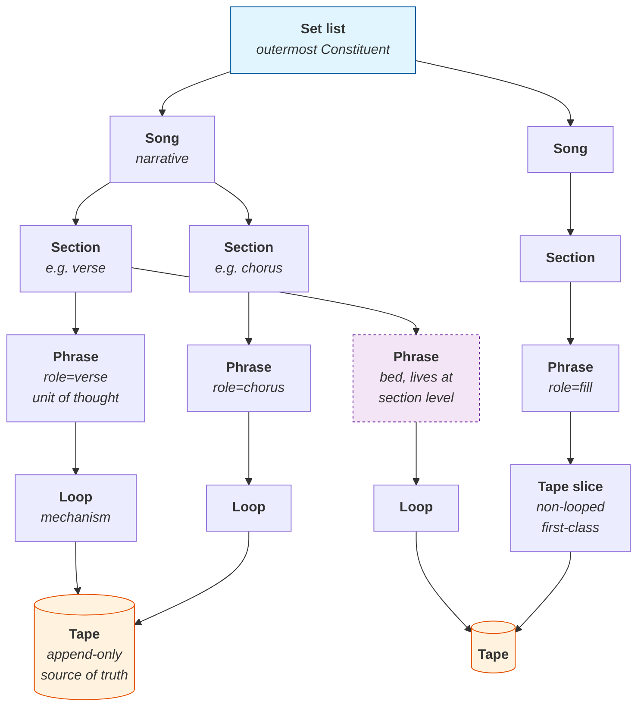
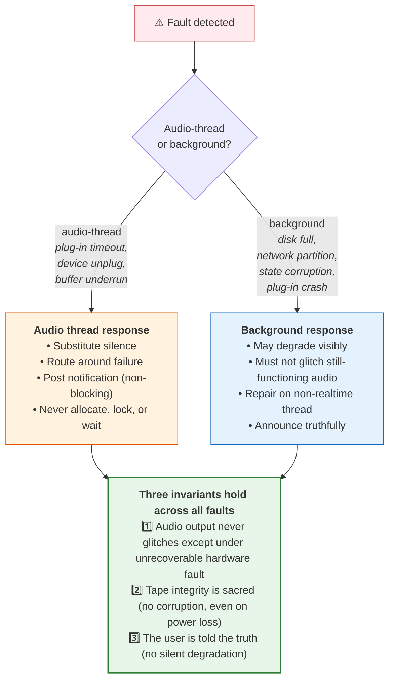

# Sirius Looper

### A Reference Architecture for Time-Domain Audio/Video Looping

*Looping as the Capture and Repetition of Musical Ideas*

---

**Status:** Draft for review
**Version:** V6
**License:** The Sirius Looper software is licensed under AGPLv3 with an Apple App Store distribution exception. The bundled Larry Seyer Acoustic Drum Library selection is proprietary and separately licensed. See `../LICENSE`, `LICENSE-THIRD-PARTY.md`, and `SAMPLE-LICENSE.md`. This document — the white paper — is offered for permissive public release.

---

## Abstract

This paper proposes a reference architecture for audio/video loopers that rejects assumptions built into nearly every existing looper, and proposes a foundational reframe that follows from rejecting them.

The rejected assumptions are: that audio sample clocks are a valid timing reference; that audio and video clocks can be synchronized to each other; that "record" is a fundamental operation; that the looper must protect the user from operating it; that time is a number; and that a loop is the unit of musical thought.

The reframe is built on three principles that hold together:

1. **A phrase is a musical utterance.** Phrases — not loops — are the unit of musical thought. A loop is a *mechanism* that a phrase may employ. A phrase may contain multiple loops, in multiple time domains, alongside non-looped material. Phrases have roles, intent, grammar, and internal time that may differ from the music surrounding them.

2. **Time is a concept, not a number.** The engine manipulates time symbolically — positions, structures, relationships — and renders to numerical time only at the membrane between digital and physical reality. This makes polymetric and polytemporal coexistence trivial, eliminates accumulated rounding error, and makes the system exact by construction rather than by representation precision.

3. **A loop is an idea, and ideas are worth repeating.** Every architectural decision exists to serve the capture, repetition, and arrangement of musical ideas without the friction that has always come with that capture.

What follows is built around a **Logical Master Clock (LMC)** treated as the only honest external timebase at the membrane, an **input mixer → tape → output mixer** signal path in which both mixers handle live audio, live MIDI, live video, and file I/O as first-class signal types, a **direct layer** that bypasses the tape for sub-millisecond live monitoring, the tape as the always-running source of truth, a unified **Constituent hierarchy** (tape → loop → phrase → section → song → set) in which each level operates in its own conceptual time domain, and a user interface that trusts the musician absolutely.

The result is a looper that can do things existing loopers cannot — including capturing polymetric phrases, supporting structural improvisation through role-fillable phrases, and reproducing micro-timing and feel exactly — while also doing the things existing loopers already do, without the friction that has always come with them. The architecture is a complete production environment from physical input to physical output, with no architectural distinction between live signals and file I/O.

---

## Table of Contents

- **Part I:** First Principles
- **Part II:** The Lies of Digital Time
- **Part III:** Time as Concept
- **Part IV:** The Logical Master Clock
- **Part V:** The Engine
- **Part VI:** The Signal Path — Input Mixer, Tape, Output Mixer
- **Part VII:** The Direct Layer
- **Part VIII:** The Tape
- **Part IX:** The Constituent Hierarchy
- **Part X:** Phrases
- **Part XI:** Polymetric and Polytemporal Coexistence
- **Part XII:** Repetition
- **Part XIII:** Arrangement and Narrative
- **Part XIV:** The Ensemble
- **Part XV:** Fidelity and Resources
- **Part XVI:** The Performer's Instrument
- **Part XVII:** Failure, Degradation, and Recovery
- **Part XVIII:** What This Architecture Enables
- **Appendix A:** Glossary
- **Appendix B:** Decision Log
- **Appendix C:** A Worked Example

---

## Changes from V5

V6 is a polish-and-diagrams pass. No architectural changes; no new substantive sections. Five Mermaid diagrams have been added at the points where the architecture is densest; one comparison table makes the looper-vs-DAW boundary visceral; export semantics are now explicit; security, hearing-impaired accessibility, and plug-in-format scope are addressed.

- **Five Mermaid diagrams** added: signal path (Part VI), Constituent hierarchy (Part IX), rendering pipeline (Part III), fault-handling decision tree (Part XVII), and worked-example timeline (Appendix C). The paper goes from dense-but-rigorous to dense-but-scannable.
- **Comparison table** added in §1.7. "Typical Looper vs Sirius Looper" on eight axes that matter to musicians (no competitor names; principle-focused).
- **§6.11 Export as a first-class destination** added. Stems, MIDI files, and video files are first-class output destinations of the output mixer (decision 64 already implied this). DAW project-exchange formats (AAF, OMF, RPP, Logic XML) are explicitly out of scope and the architectural reason is given.
- **§14.10 Security and privacy** added. End-to-end encryption of coordination messages, air-gapped solo as default, consent model for shared Constituents.
- **Hearing-impaired accessibility** added to §16.10. Vibrotactile, visual-substitute, and captioning paths complete the symmetry with the visual-alternative paths.
- **Plug-in format scope** noted in §15.6. CLAP, VST3, and AU are the target formats; AAX and platform-specific exotics are open.
- **Capability tiers** referenced earlier (§1.6) with concrete hardware examples so readers know what each tier feels like before reaching Part XV.
- **§6.2 two-layer routing** restructured as a small table (replacing dense prose).
- **Glossary cross-references** added for *ASRC*, *direct layer*, *retroactive ring* on first body use, completing the set started in V4.
- **Decision Log** gets a "Recent decisions" pointer at the top for findability, plus V6 entries.

## Changes from V4

V5 was a substantive revision pass. The architecture is unchanged; what's new is rigor about what the architecture *guarantees* and what happens when reality intrudes.

- **Part XVII — Failure, Degradation, and Recovery** added (renumbering the previous Part XVII to Part XVIII). Defines the fault model the architecture is responsible for: resource exhaustion, device events, plug-in failure, network partition, clock instability, state corruption, power loss. The paper was previously ideal-path complete; this section makes it fault-model complete.
- **§5.6 Realtime execution guarantees** added. The latency claims in §16.8 depend on the audio thread never blocking; this section makes the operational commitments architectural rather than implicit.
- **§15.6 Plug-in determinism and archival fidelity** added. The archival-fidelity claim is now correctly qualified: symbolic fidelity is unconditional; re-render fidelity depends on the DSP chain. Three strategies (determinism contract, wet capture, version pinning) are defined.
- **§1.7 Why this is still a looper** added. Answers the boundary question directly: the architecture expands outward from looping, not inward from DAW paradigms.
- **§14.9 What this section does not yet specify** added. Honest acknowledgment that ensemble-layer specifics (consistency model, partition behavior, conflict resolution) are deferred. The constraints are committed; the specifics are not.
- **A note on the term "Constituent"** added at the head of Part IX. The term is borrowed from grammar for exactly the right reason; the friction of learning it is paid once.
- **Mathematical wording tightened** in several places. "Exact" and "bit-identical" claims now carry the implied qualifications they always required.
- **Appendix C — A Worked Example** added. End-to-end narrative walkthrough of a single phrase from capture to archive.
- **Decision Log** extended with V5 entries.
- **Open Questions** updated to reflect V5 closures and remaining gaps.

## Changes from V3

V4 was a polish-and-completeness pass over V3. No architectural revisions; the framework was unchanged.

- **Numbering corrected** throughout Parts IX–XVII (V3 had stale subsection numbers from earlier drafts).
- **MIDI 2.0 / UMP** treatment added in Part VI — the tape format and Constituent model are stated to be MIDI 2.0-native, with per-note expression as first-class automatable parameters.
- **Accessibility** addressed in Part XVI — one-handed operation, color-blind modes, screen-reader support for preparation state, and large-print glanceable HUD options.
- **Validation Strategy** added as Part XV, §15.5 — explicit measurement protocols for the paper's exactness claims.
- **Glossary cross-references** added on first use of *Constituent*, *membrane*, *LMC*, *ASRC*.
- **Decision Log** extended with V4 entries.

A companion *Implementation Notes* document — pseudocode, benchmarks, JUCE 8 mapping, and worked examples beyond Appendix C — is referenced where appropriate but is deliberately not included here. The white paper remains pure architecture.

---

# Part I — First Principles

Before any architecture, six principles. Everything that follows is a consequence of these.

### 1.1 A loop is an idea.

The loop is not a recording. It is not a buffer. It is not a time interval. Those are implementation details of the thing the loop *is*: **a musical idea, captured in a form that allows it to be heard again.**

This framing is not poetic indulgence. It is the only framing that produces a looper that serves musicians rather than confounds them. When the loop is treated as an idea, every design question becomes tractable: how do we capture ideas without losing them? How do we let ideas repeat in ways that feel musically alive? How do we let ideas combine into larger ideas? How do we let ideas develop? These are the questions a looper answers.

### 1.2 Ideas are worth repeating.

Repetition is not a feature of the looper. Repetition is the *point* of the looper. The performer captures an idea precisely because they want to hear it again. The architecture must therefore make repetition *musical* — alive, variable, responsive — rather than merely mechanical. The instant repetition becomes mechanical is the instant the idea dies.

### 1.3 A phrase is a musical utterance; a loop is one mechanism it may use.

A loop and a phrase are not the same thing. **A phrase is a complete musical utterance** — with its own internal shape, entrance, body, and resolution — containing whatever combination of looped and non-looped material the music demands. A loop is a *mechanism* by which content within a phrase may repeat. Phrases have grammar, roles, and intent that loops do not. A phrase may contain several loops which may or may not be related, alongside one-time content, alongside silence as content.

This distinction reorganizes the entire architecture: the loop drops back to being a tool, and **the phrase becomes the unit of musical thought.** Arrangement happens at the phrase level and above; mechanism happens at the loop level and below.

### 1.4 Time is a concept, not a number.

The engine does not measure time. It manipulates time symbolically — positions, structures, relationships, hierarchies of nested time domains. Numerical time exists only at the *membrane* (see Glossary) between digital and physical reality, where sound must actually emerge from a speaker. **Inside the engine, everything is symbolic; only at the membrane does the symbolic become numerical.**

This principle dissolves problems that have plagued digital audio for decades: accumulated rounding error, the impossibility of reconciling audio and video clocks, the difficulty of representing polymetric music, the loss of micro-timing under quantization. None of these are problems in conceptual time. They are problems that arise *only* when conceptual time is forced into a single numerical grid.

### 1.5 The looper trusts the user.

The user is a musician. They know what they want, when they want it, and how they want it. The looper's job is not to constrain, not to guide, not to second-guess, not to protect them from their own choices. **The looper's job is to anticipate what the user is likely to want at any given moment, present that affordance, and then disappear.**

Many design decisions in existing loopers can be traced to a quiet assumption that the user might make a mistake. That assumption is itself the failure. A looper built on trust will be vastly more powerful and vastly more transparent than one built on caution.

### 1.6 The looper is a complete production environment from physical input to physical output.

The looper captures, conditions, repeats, arranges, mixes, and renders. It owns the full signal path: **input mixer → tape → output mixer**. It is the input mixer, it is the tape, and it is the output mixer. The mixing decisions on both sides of the tape are part of the artistic act and therefore part of the looper's responsibility.

What remains out of scope:

- **Cross-application audio routing.** Sending audio to/from other applications via JACK, Soundflower, loopback drivers — the operating system handles this.
- **Mastering as a final delivery step.** True mastering for commercial distribution is a specialized post-production discipline with its own tools and conventions.
- **External instrument control as primary output.** The looper produces audio and video; it may emit MIDI as a side effect, but driving external hardware instruments is not its central function.

Everything else — capture, conditioning, looping, arrangement, mixing — is the looper's responsibility, because the artist's creative act spans the entire signal path and the architecture should not introduce seams the user has to live in.

The single most important nuance: **arrangement is creation, not processing.** The order in which phrases play, the sections they form, the songs they compose into, the transitions between them — these are part of the musical idea, not separate from it. The looper is responsible for arrangement at every level of the *Constituent* hierarchy (see Glossary).

The architecture is built to scale. **Capability tiers** (Part XV) let the system size itself once at startup against the hardware actually present, ranging from *Lavish* (Mac Studio class — unlimited effects, video, ensemble) through *Comfortable* (M-series laptop — typical home-studio loadout) and *Tight* (last-decade desktops, modern tablets — audio plus modest effects) down to *Survival* (2018-era iPad — rock-solid audio, no video, no ensemble). The rules across all tiers are the same; what changes is the budget. The performer never thinks about which tier they are on. The system does.

### 1.7 Why this is still a looper.

The principles above accrete scope: input mixer, output mixer, arrangement engine, archival system, video pipeline, MIDI 2.0 substrate, ensemble networking. A skeptical reader might reasonably ask whether this is still a looper at all, or merely a DAW reinvented from first principles.

The answer is precise:

- **Looping remains the primitive act.** Capture, repeat, vary, arrange. These are the central musical operations. Everything else exists to serve them.
- **Repetition is the central musical operation.** The Constituent hierarchy exists so that repetition can scale from a one-bar loop to a complete set without changing structure. The five-axis repetition rules (Part XII) are not a feature of the looper; they *are* the looper.
- **Arrangement emerges from repeated material.** The set list is the outermost Constituent because a performance is the largest scale at which loops cohere into meaning. Arrangement is not appended to looping; it is what looping becomes at scale.
- **The system expands outward from looping rather than inward from DAW paradigms.** A DAW is a recording-and-arrangement system to which looping has been added as a feature. This is a looping system that took looping seriously and grew the rest of the production environment as its consequence. The architectural shape is different, and a reader who treats the two as variants of the same thing will misunderstand both.
- **The user's central act is unchanged.** Capture an idea, hear it repeat, vary it, combine it. Every architectural commitment exists to make that central act fast, fluid, and trustable.

What a DAW does that this architecture does not: stitching unrelated takes into a fixed timeline, surgical waveform editing, mastering, project management for hire-out engineers. Those are real activities. They are not loops. The architecture does not pretend to address them.

The boundary is most legible in comparison. On the axes that matter to a performer:

| Axis | Typical Looper | Sirius Looper |
| --- | --- | --- |
| Pre-declaration of loop length | Required before recording starts | Not required; tape is always running |
| Punishment for imprecise timing | In-points and out-points commit at the footswitch press | Boundaries refined retroactively from the tape |
| Polymetric / polytemporal coexistence | Single shared grid; loops must agree on tempo and meter | Each Constituent in its own conceptual time domain |
| Micro-timing fidelity | Quantized or smoothed by the recording grid | Preserved exactly; conceptual time has no quantization grid |
| Live monitoring latency | One audio-buffer round trip minimum | Sub-millisecond via direct layer, independent of tape |
| Arrangement | Outside the looper's scope, handled by a host DAW | First-class; the set list is a Constituent |
| Archival recoverability | Wet rendering only; original takes lost on overdub | Dry tape and parameter tape preserved; symbolic fidelity is unconditional |
| Failure handling | Glitch on plug-in crash; corruption on power loss | Audio never glitches; tape integrity sacred across power loss |

Each row is the consequence of one or more of the six first principles. The architecture is not a longer list of features; it is a different shape.

---

# Part II — The Lies of Digital Time

The most important sentence in this paper is one most audio engineers have never said out loud: ***there is no true time on any computer, only the best disciplined approximation.*** Every other architectural decision in this document depends on internalizing that statement.

### 2.1 The first lie: sample clocks

When an audio interface reports that it is sampling at 48 kHz, what it actually means is that an onboard crystal oscillator, divided down by a clock chip, is producing strobes that *approximately* arrive at 48,000 per second. The actual rate is determined by the crystal's manufacturing tolerance (typically ±10 to ±50 parts per million), its temperature, its age, the voltage on its supply rail, and acoustic shock to the housing. A "48 kHz" interface in a cold studio at the start of a session and the same interface in a warm room two hours later are running at different rates.

Two audio interfaces nominally clocked at 48 kHz, recording the same source, will produce recordings whose lengths differ by milliseconds over a single song and seconds over a single set. There is no engineering trick that eliminates this. It is the nature of the substrate.

### 2.2 The second lie: frame clocks

Video clocks are worse. The nominal frame rates of professional video — 23.976, 24, 25, 29.97, 30, 50, 59.94, 60 — exist for reasons of broadcast compatibility, not for reasons of mathematical alignment with anything else. The 0.1% pulldown that produces 29.97 from 30 was a compromise for color NTSC's subcarrier spacing in 1953, and we are still living with it.

Worse still: video frame timing is constrained by display vertical sync, which is itself determined by the panel's onboard clock, which is itself a crystal with all the imprecision of any other crystal. Frames are not delivered to the display "at 60 Hz" — they are delivered approximately every 16.67 milliseconds, with jitter that varies by GPU driver, OS scheduler, and load. Even "frame-accurate" video is, at the substrate level, approximately accurate.

### 2.3 The third lie: standards cannot be synchronized

It is mathematically impossible for 48,000 samples per second to be exactly synchronized to 29.97 frames per second. The numbers do not share a useful common divisor. Whatever apparent synchronization you observe is the product of one or both of those clocks being silently warped to make them appear to agree.

The industry has built a vast technical infrastructure on the premise that these standards are real. They are not. They are conventions, and the conventions do not mathematically close.

### 2.4 The only honest answer

If sample clocks lie and frame clocks lie and the standards cannot be reconciled, then the only honest architectural response is to refuse to use any of them as a master timing reference. **The master must be something else — something that does not pretend to know anything about audio samples or video frames, and against which both can be measured and corrected.**

That something — at the *membrane*, where physical reality begins — is **absolute time**: a monotonic, high-resolution time reference that exists *above* the audio and video clocks and treats both as merely the imperfect substrates they actually are. Inside the engine, however, the answer is deeper still, and is the subject of the next part.

---

# Part III — Time as Concept

The earlier draft of this paper treated absolute time as the master timebase throughout. That treatment was incomplete. **Absolute time is the master at the membrane. Inside the engine, time is a concept — symbolic, hierarchical, exact by construction.**

This part establishes the principle, its consequences, and the architectural pattern that follows from it.

### 3.1 The principle

> **Time is a concept the system manipulates symbolically. Numerical time is a rendering, not a representation. The engine thinks in musical and structural relationships; the membrane renders those relationships against absolute time at the moment of audible production.**

This is the same architectural pattern as *time-domain at the core, sample-domain at the membrane* — restated one level higher. Just as the engine renders symbolic time intervals to samples at the membrane, the engine now renders **conceptual positions** to **numerical times** at the membrane. The numerical world only exists where physics demands it.

### 3.2 What conceptual time means in practice

A loop's boundary is not "47 milliseconds and 832 microseconds." It is a *position* — described in whatever conceptual terms the loop's context calls for:

- "The downbeat of bar 1 of phrase A, in phrase A's local meter and tempo"
- "The third quintuplet of beat 4 of loop X"
- "The anchor where phrase B aligns to section C's boundary"

These are **symbolic positions in conceptual time**. They are exact because they are *defined* exactly, not because they are measured exactly. The exactness comes from the symbolic structure, not from precision of representation.

### 3.3 What this dissolves

Three categories of problem dissolve once conceptual time is accepted as the engine's substrate.

**The PPQ problem.** Existing systems must choose a tick resolution that accommodates every musical subdivision they want to support. 480 PPQ disallows septuplets. 3840 PPQ does too. To support 11-tuplets cleanly, the LCM gets very large. *In conceptual time, this problem does not exist.* A 7-tuplet is "7 in the space of 4" — a structural relationship, not a number on a grid. There is no shared grid that must accommodate every subdivision simultaneously.

**The polymetric reconciliation problem.** A 4/4 loop and a 7/8 loop in the same phrase cannot share a sample-level grid without one of them being approximated. *In conceptual time, they don't need to.* Each lives in its own conceptual time domain. They meet only at phrase boundaries, conceptually, and the rendering at the membrane resolves both to absolute time independently.

**The accumulated-rounding problem.** Any system that stores time as floating-point or fixed-grid integers accumulates error over thousands of operations. A loop in its hundredth cycle drifts from a loop in its first cycle. *Within the engine's conceptual time, there is nothing to round.* The conceptual position of "beat 3 of loop X, cycle 100" is identical to "beat 3 of loop X, cycle 1" — same position, same definition, different rendering moment. Rounding does happen — but only once per render, at the membrane, where it is bounded by the device's clock precision rather than accumulated across cycles.

### 3.4 The hierarchy of time domains

Conceptual time is not flat. It is a *tree*, with each level potentially having its own structure:

- **Session time** — the outermost domain, anchored to *LMC* absolute time (see Glossary)
- **Song time** — may have its own tempo map, independent of session
- **Section time** — may have its own structure within the song
- **Phrase time** — may have its own meter and tempo within the section
- **Loop time** — may have its own meter within the phrase
- **Cycle time** — the position within a single playback of a loop

Each level inherits its parent's time domain by default but may declare its own. The conceptual position of any event is its position within its immediate parent, *recursively unrolled* up the tree at rendering time to produce the absolute time at the membrane.

### 3.5 Conceptual time is more exact than numerical time

There is one thing worth saying explicitly because it could be misunderstood: **conceptual time is not vague time.** It is *more* exact than numerical time, not less. A musical position described as "the third sixteenth of bar 4 of phrase A in its local 7/8 meter" is *unambiguous* — there is exactly one moment it refers to, given the surrounding context. There is no rounding, no drift, no accumulated error.

This is the same kind of move that mathematics makes when it deals with irrational numbers symbolically (π, e, √2) rather than approximating them. Numerical representation introduces error; symbolic representation is exact. The engine works in the symbolic domain. The membrane renders to the numerical domain at the latest possible moment.

### 3.6 The rendering pipeline

When a sample must be produced for the audio interface at the next callback, the engine performs the following at the membrane:

1. Identify which conceptual positions are active at the upcoming render window
2. Unroll each position's hierarchical context (session → song → section → phrase → loop)
3. Apply the relevant tempo maps at each level to convert conceptual position to absolute LMC time
4. Apply device calibration to convert LMC time to device sample index
5. Render the sample



The dashed boundary marks the membrane. Everything to its left is symbolic and resolution-independent; everything to its right is numerical and device-specific. This pipeline is executed only at the membrane, only when needed, and only with the precision the membrane requires. Above this layer, the engine knows nothing of samples, frames, or absolute time.

### 3.7 Editing is symbolic

A consequence worth noting: **editing a loop boundary does not change a number from 47.832 to 47.913. It changes a *reference* from "the downbeat of bar 3" to "the second eighth of bar 3."** Edits are operations on conceptual structures, not on numbers. This makes editing exact, deterministic, and free of representation artifacts.

### 3.8 Axiom for the paper

> **Conceptual at the core, numerical at the membrane. The engine manipulates time symbolically; numerical precision is a property of the membrane, not the engine. Nothing observable depends on greater precision than the membrane offers.**

---

# Part IV — The Logical Master Clock

With conceptual time as the engine's internal substrate, the LMC's role is now precisely defined: **the LMC is the discipline mechanism for the membrane.** It is not the engine's internal time. It is the absolute-time reference against which numerical time is rendered at the moment a sample or frame must physically exist.

### 4.1 Definition

The LMC is a software construct above all hardware clocks. It is exposed to the rendering layer (and only the rendering layer) as a continuously-advancing absolute-time reference. Every hardware clock — audio device clocks, video device clocks, the host CPU clock itself — is treated as a *source* against which the LMC is disciplined, never as the LMC's master.

### 4.2 The discipline hierarchy

At session start, the LMC selects its discipline source from the best available option in a strict hierarchy:

| Tier | Source | Typical precision | Use case |
|---|---|---|---|
| 1 | GPS-disciplined / atomic | sub-microsecond | Broadcast, scientific rigs |
| 2 | PTP / IEEE 1588 grandmaster | microseconds | Pro studios with Dante/AES67 |
| 3 | NTP stratum 1–2 | milliseconds | Networked workstations |
| 4 | Ableton Link peers | peer-consensus | Live ensembles |
| 5 | Local CPU monotonic | drift-bounded against itself | Solo, offline |

When nothing external is reachable, local CPU monotonic *is* the LMC — self-consistent within a session, which is sufficient for solo work.

### 4.3 Calibration tables

Every hardware clock at the membrane carries a calibration record against the LMC:

```
ClockCalibration {
    source_id           // which hardware clock
    rate_factor         // measured rate ratio (e.g., 0.999987)
    offset              // measured constant offset (in LMC time units)
    last_updated        // when this calibration was measured
    confidence_interval // statistical uncertainty
}
```

These tables are refreshed continuously by background measurement. The rendering layer reads them to convert from LMC time to device-native time. They are the only place in the system where audio sample indices and video frame indices live.

### 4.4 Behavior under reference loss

When the LMC's discipline source becomes unavailable mid-session, the LMC continues smoothly using local CPU monotonic at the last known disciplined rate. There is no step, no glitch, no audible discontinuity. When the reference returns, the LMC re-engages via *gradual rate slewing* over seconds or minutes — never an instantaneous re-lock.

### 4.5 Archival fidelity

The LMC's discipline history is recorded as session metadata. Years later, the LMC's relationship to UTC at the moment of any recorded event is reconstructable to the precision the discipline source allowed. This makes recordings made under this architecture **archivally valid** at a level most current systems cannot match.

### 4.6 The LMC's relationship to conceptual time

The LMC and conceptual time meet at exactly one place: **the rendering pipeline at the membrane.** The conceptual position of a musical event is unrolled through its hierarchical context, the result is mapped to LMC absolute time via the session's outermost tempo map, and the LMC time is then mapped to device-native time via the calibration tables. Three transformations, applied in order, at the latest possible moment.

### 4.7 Axiom for the paper

> **There is no true time on any computer — only the best disciplined approximation. The LMC is that approximation, lives at the membrane, and is the only thing in the system that ever produces a number representing absolute time.**

---

# Part V — The Engine

With conceptual time and the LMC established, the engine architecture follows.

### 5.1 Conceptual at the core, numerical at the membrane

The looper engine does not deal in samples, frames, or absolute time. It deals in **conceptual positions** within nested time domains. Samples and frames exist exactly twice in the engine's signal path: at the input membrane (capture, timestamping) and at the output membrane (presentation, rendering). Between those two points, the engine knows only concept.

This is the fundamental architectural inversion of this looper. Most loopers count samples and bolt time-correction layers on top. This one *thinks in music* and emits samples at the edges.

### 5.2 The signal path: input mixer → tape → output mixer, with direct layer

The engine's architecture is a three-stage signal path with a parallel bypass. At each end is a **mixer** — a software object that handles channel topology, signal conditioning, and the crossing between physical and conceptual time. In the middle is the **tape**, the always-running source of truth. Bypassing the tape entirely is the *direct layer* (see Glossary), a parallel signal path used for sub-millisecond live monitoring and reinforcement. The direct layer is detailed in Part VII.

```
                       ┌──────── DIRECT LAYER ────────┐
                       │   (zero-tape latency)        │
                       │                              ▼
Physical inputs → INPUT MIXER → TAPE → OUTPUT MIXER → Physical outputs
& file inputs                                          & file outputs
```

Each channel in the input mixer makes its own routing decisions: whether it writes to tape (and in what mode), whether it feeds the direct layer (and in what mode), and to which destinations. Each channel in the output mixer similarly chooses among physical outputs, file destinations, MIDI outputs, video outputs, and internal buses. **Routing decisions are per-channel, not per-input or per-output**, because the channel is the natural unit of processing and routing in mixer architecture.

**The input mixer** is the inbound stage. It accepts four signal types as first-class inputs: **live audio, live MIDI, live video, and file inputs**. Routing decisions exist at two layers: **input-layer** decisions about the source itself (raw direct monitor on/off, source enable, source-level defaults that channels inherit) and **channel-layer** decisions about the processed signal (tape mode, processed direct routing, destinations, per-channel processing). One input may feed multiple channels with different musical roles; multiple inputs may sum into one channel. The input layer is configured once at setup; the channel layer is where the user works musically. Each channel applies capture-time conditioning appropriate to its signal type — gain staging, EQ, dynamics, and bus routing for audio; transpose, velocity curve, and event filtering for MIDI; scaling, color, and format conversion for video; transport and rate control for file inputs. Each channel may operate in *commit-to-tape* mode or *non-destructive* mode. Critically — and this is the consequential decision in V3 of this paper — the input mixer is **a full creative mixer**, not merely a structural router. See Part VI for the deeper treatment.

**The output mixer** is the outbound stage. It accepts the rendered output of the Constituent hierarchy — every active loop, phrase, and section, rendered against absolute time at the present moment — as well as direct-layer signals bypassing the tape, and produces four output types as first-class destinations: **live audio, live MIDI, live video, and file outputs**. Routing decisions are similarly two-layered: **channel-layer** decisions about each output channel's processing and destinations, and **output-layer** decisions about each physical or file destination (master gain, dither, file format, format conversion). Each output mixer channel applies channel-strip processing and chooses its destinations per channel: physical outputs, file destinations, internal buses, monitor sends, or any combination. Like the input mixer, it is **a full creative mixer**, with per-Constituent channel strips, session-level effect buses, recallable mix snapshots, and master bus processing.

**The tape** sits between them. Everything the input mixer produces is captured to tape. Everything the output mixer renders is sourced from tape (via the Constituent hierarchy). The tape is the architectural pivot point: above it (toward the user) is the world of musical ideas; below it (toward the hardware) is the world of samples and frames.

Between these three stages, the engine operates entirely in conceptual time. Numerical time exists only at the input mixer's inbound membrane (where samples arrive) and the output mixer's outbound membrane (where samples leave).

### 5.3 Continuous async sample-rate conversion at the mixers

The mixers are where conceptual time meets the physical reality of an audio interface running at "48 kHz" that is actually running at some slightly different rate. Bridging this is the job of **continuous async sample-rate conversion** (*ASRC*; see Glossary) at each mixer's membrane.

The ASRC's quality determines the looper's audible fidelity. Cheap ASRC produces audible chirping artifacts on sustained content; transparent ASRC (libsoxr's VHQ preset is the industry reference) is computationally expensive but inaudible. Budget approximately 3–5% of one CPU core per channel for VHQ-quality continuous resampling.

Video has an equivalent membrane: frame-rate conversion between the camera's actual capture rate and whatever rate is needed for storage, processing, or display. The simplest approach is nearest-frame selection; more ambitious implementations use motion-compensated frame interpolation. Implementation choice; the engine architecture above the membrane is identical regardless.

### 5.4 Tempo maps as conceptual transformations

A tempo map is no longer "a function from absolute time to musical position." It is **a transformation between two conceptual time domains** — typically between a parent's time and a child's time. Each level of the hierarchy may have its own tempo map relating its time to its parent's.

Tempo maps are stored as sequences of breakpoints expressed in their own conceptual terms ("at this position in the parent, this position in the child"). They become numerical only when the rendering pipeline unrolls a position through them.

For piecewise-constant tempo, the transformation is linear in each segment. For tempo ramps, it is piecewise quadratic. The implementation is straightforward; what matters architecturally is that **the tempo map is conceptual, not numerical**, and is only numerically evaluated at the membrane.

### 5.5 Latency compensation as architectural

When the input mixer receives a sample buffer from a device, the samples were not captured *now*. The sample at index N in a buffer of size B was captured at:

```
LMC_capture_time = LMC_callback_time − latency_input − (B − N − 1) / device_rate
```

The input mixer applies this transformation before the sample becomes a tape entry. From the engine's perspective, **every tape entry carries its true conceptual time of capture**, not its arrival time.

Outbound, the mirror transformation tells the output mixer when each sample in an output buffer will actually be heard:

```
LMC_present_time = LMC_callback_time + latency_output + N / device_rate
```

The rendering pipeline aims at this future time, not the present.

Device latencies are typically reliable on CoreAudio and ASIO, less reliable on WASAPI, and effectively absent on USB Class-Compliant on some platforms. To handle this generally, the system performs a **one-time loopback calibration per device**: output a known click, capture it back, measure the round-trip in samples, store the result. Subsequent sessions on the same device read the stored calibration.

### 5.6 Realtime execution guarantees

The architecture makes claims about latency budgets (see §16.8) that are achievable only if the engine never blocks the audio thread. These are the operational commitments that make the latency claims real. They are architectural, not implementation details.

- **The audio thread runs unbounded-latency-free.** No operation on the audio thread may have unbounded execution time. Memory allocation, lock acquisition, file I/O, synchronous device I/O, blocking on plug-in code, and any operation whose worst-case runtime cannot be bounded statically are forbidden. Parameter changes arrive via lock-free message queues.
- **Constituent graph mutation is non-blocking from the audio thread's perspective.** Mutations happen on a non-realtime thread; the audio thread reads the graph through an atomically-swapped snapshot pointer. The audio thread never sees a partially-mutated graph and never blocks on a mutation in progress.
- **Tape append is wait-free.** Tape events are written through a single-producer single-consumer queue from the audio thread to a non-realtime writer thread. The audio thread's contribution to a tape write is a fixed, bounded operation.
- **ASRC operates on a bounded ring.** The ASRC's working memory is fixed at session startup based on the capability tier. The audio thread never allocates inside the ASRC.
- **Plug-ins run in their own isolation.** A plug-in's misbehavior — a crash, a hang, an unbounded internal loop — cannot block the host audio thread. A watchdog timer bounds plug-in execution time per buffer; on timeout, the plug-in is bypassed and the user is informed.
- **The direct layer is audio-thread-exclusive and stateless.** Direct routing is a pure function of input buffers. No allocation, no locks, no graph traversal.
- **The graph is shallow at audio-thread depth.** The Constituent hierarchy can be deep (set → song → section → phrase → loop → cycle), but the audio thread sees a flattened, pre-computed schedule of active tape reads for the current buffer. Tree traversal happens on the non-realtime thread.

Implementations that violate any of the above violate the architecture, regardless of how clever the workaround. The audio-thread budget is the architecture's hardest constraint and the source of the rest of the latency story.

---

# Part VI — The Signal Path: Input Mixer, Tape, Output Mixer

Part V introduced the three-stage signal path. This part is its detailed treatment.

The architecture has a deliberate symmetry: a full creative mixer on each side of the tape, with the tape as the always-running pivot between them. This symmetry matters. It means the looper is not a "recorder with playback" — it is **a production environment in which capture and playback are equally first-class operations, each with its own complete mixer.**



The dashed arrow is the direct layer (Part VII): a parallel path that bypasses the tape entirely, carrying signal but not time-anchored data. Solid arrows are the canonical signal path. Each modality is first-class in both mixers; the channel processing inside each strip is appropriate to its modality.

## 6.1 The mixers are modality-agnostic

Both mixers handle four signal modalities as first-class citizens, not as special cases:

**Live audio.** Sample buffers from microphones, line inputs, USB audio interfaces, network audio sources. Processed with audio-appropriate tools (gain, EQ, dynamics, sends). Written to and read from audio tapes.

**Live MIDI.** Event streams from USB MIDI, DIN MIDI, virtual MIDI ports, MIDI controllers — encompassing both MIDI 1.0 messages and MIDI 2.0 Universal MIDI Packets (UMP), with full support for per-note expression: per-note pitch bend, per-note articulation, poly-aftertouch, and MPE-style channel allocation. Processed with MIDI-appropriate tools (transpose, velocity curve, channel filter, event remap, quantize, per-note expression curve). Written to and read from MIDI tapes.

**Live video.** Frame buffers from webcams, capture cards, NDI sources, screen captures. Processed with video-appropriate tools (color, scaling, format conversion, framing). Written to and read from video tapes.

**File I/O.** Pre-existing audio, MIDI, and video files entering the session as inputs (import) or being produced by the session as outputs (export, render, stems). File I/O is not a separate operation outside the mixer — it is just another input or output type.

The mixer is a single architectural concept; the processing inside each channel strip is appropriate to the signal type carried by that channel. **An audio channel strip and a MIDI channel strip and a video channel strip and a file channel strip are different in their internal processing but identical in their role in the signal path.** They all route, condition, and gate their signals between the physical-or-file world and the tape world.

This architecture eliminates several seams that plague traditional production environments:

- **File import is not modal.** A pre-existing audio file dropped into the session enters via the input mixer just like a live mic. The system downstream of the input mixer cannot distinguish "live capture" from "imported file" — and shouldn't need to. A file is just a tape that already exists, with a synthesized capture timestamp.
- **File export is not modal.** Rendering a session (or any portion of it, or any bus, or any combination of buses) is just routing the output mixer's selected signals to a file destination instead of a hardware destination. Same mixer, same chain, same processing. **Render is just playback aimed at a file.** There is no separate render engine and no online-vs-offline mode discrepancy.
- **MIDI is not segregated.** MIDI does not have a separate "MIDI section" of the application with its own architecture. It flows through the same input mixer as audio, through the same tapes, through the same Constituent hierarchy, and out through the same output mixer.
- **Video is not bolted on.** Video is a first-class signal type from the start, with the same architectural status as audio. It is captured, processed, looped, arranged, and rendered through the same pipeline.
- **Cross-modality routing is free.** A MIDI tape can drive a software synth whose audio output enters the audio side of the output mixer; a video tape can be modulated by an audio tape's envelope; an audio tape's transients can trigger MIDI events. These are just routing choices in mixers that already speak all four modalities.

**MIDI 2.0 / per-note expression is first-class.** The tape format is event-shaped (timestamp + payload), and the payload is wide enough to carry a full UMP packet without translation. Per-note pitch bend, per-note pressure, per-note articulation, and 32-bit-resolution controllers are stored on tape exactly as received and reproduced exactly on playback. Per-note expression streams are treated as automatable parameters in the Constituent model: a phrase can carry, repeat, and mutate per-note vibrato as easily as it carries notes themselves. MIDI 1.0 input is upcast to UMP at the membrane and stored in the same canonical form, so a 7-bit CC and a 32-bit per-note controller occupy the same architectural slot. This is not a forward-compatibility hedge; it is the only sensible representation given the rest of the architecture, and it differentiates the looper from every existing system that treats MIDI as a 7-bit afterthought.

## 6.2 Two layers of routing: input layer and channel layer

The input mixer makes routing decisions at two distinct layers, each meaningful in its own right.

| | **Input layer** | **Channel layer** |
| --- | --- | --- |
| **About** | The source itself | The processed signal |
| **When configured** | Once at setup; rarely revisited | During musical work; changes with the music |
| **Decisions** | Raw direct monitor on/off · Source enable · Source-level defaults · File transport (start, rate, loop region) | Channel processing chain · Tape mode (commit-to-tape / non-destructive / no-tape) · Processed direct routing · Destinations (tapes, buses, outputs) |
| **Captured in snapshots?** | No — these are session topology | Yes — these are mix state |

The two layers compose cleanly. One input may feed multiple channels with different musical roles: a guitar input might feed a "Clean Guitar" channel and a "Distorted Guitar" channel, each with its own processing and tape routing, while sharing the same input-layer raw-direct setting. Multiple inputs may sum into one channel. **The user works almost entirely at the channel layer; the input layer is configured once and forgotten.**

A note on the tape mode column: *commit-to-tape* bakes the channel's processing into the tape (processing is permanent); *non-destructive* writes the dry signal to one tape and the channel's processing parameters to a parallel parameter tape (processing is recoverable); *no-tape* feeds outputs and the direct layer but captures nothing. The choice is per-channel and is itself part of the artistic act — see §6.3.

## 6.3 Commit-to-tape vs. non-destructive: the per-channel choice

The most consequential channel-layer decision is **whether processing is committed to tape or recorded as recoverable metadata.** This is settable per channel.

**Commit-to-tape mode (printed).** The channel's processing is applied to the signal *before* the tape. The tape captures the processed, artistically conditioned signal. The processing is permanent — it cannot be undone later by editing the channel settings, because what's on the tape is the processed result, not the raw input.

This is appropriate when:
- The engineer is confident in the sound
- The processing is part of the artistic character (a known amp simulation, a familiar compressor)
- Storage economy matters (one tape per channel, not two)
- The recording will not need retroactive treatment changes

**Non-destructive mode (recoverable).** Two tapes are written in parallel: one carries the dry input signal as it entered the channel; the other carries the channel's processing parameters as a parameter tape running alongside. The signal heard during capture is the processed version (monitoring sounds right), but the dry signal is preserved on tape. Retroactive editing of the channel's processing changes the playback output without touching the dry tape.

This is appropriate when:
- The engineer is uncertain about the final sound
- The same source might want different treatment in different contexts
- Archival recoverability matters
- The performance is exploratory and the engineer wants to preserve options

The two modes coexist freely across channels. A single session might have a vocal channel in non-destructive mode (because the singer's tone might need adjustment in the mix) and a guitar channel in commit-to-tape mode (because the amp simulation is part of the song's identity). The data model supports both natively, because *processing parameters are themselves a tape* — committing to tape is just choosing not to keep the parameter tape separately.

## 6.4 The user chooses the session's tape topology

A direct consequence of channel-layer routing decisions: **the number of tapes in a session is determined by the user's channel configuration, not by the system.** The user composes their tape topology by composing their channel topology.

- A channel may write to **zero** tapes (live monitoring/reinforcement only — signal flows through the mixers and the direct layer but is never captured)
- A channel may write to **one** tape (commit-to-tape mode — the common case)
- A channel may write to **two** tapes (non-destructive mode — dry tape + parameter tape running in parallel)
- A channel may write to **multiple** tapes if explicitly routed (one channel feeding several tapes for parallel takes, A/B comparison, redundancy)

And inversely:

- A tape may be fed by **one** channel (the common case)
- A tape may be fed by **multiple** channels summing to a sub-mix tape (a bus channel's output going to tape)
- A tape may currently be fed by **zero** channels but contain historical content from past sessions or imports

A session with one mic and a single channel strip is one tape. A session with eight drum mics, each on its own channel plus a drum bus channel capturing the sub-mix, is nine tapes. A session with non-destructive mode on every channel is double the tape count. **Tapes appear because channels demand them.**

This makes session resource cost transparent and user-controlled. A user who needs a lighter session reduces channels; a user who needs more capture flexibility adds channels. The system imposes no fixed tape count; the capability tier (Part XV) determines what is *practical* rather than what is *possible*.

There is no hidden tape-management layer. The user sees their mixer; the mixer's channels imply the tapes; the tapes are the source of truth. **Tape topology is mixer topology.**

## 6.5 The tape, briefly

The tape is detailed fully in Part VIII. The signal-path summary: it is append-only, immutable, always-running, and carries timestamped events from one input each. Multiple parallel tapes accommodate multi-channel sources and parallel dry/processing recordings. **The tape is the source of truth and the architectural pivot point of the entire system.**

## 6.6 The output mixer

The output mixer receives the Constituent hierarchy's rendered output and direct-layer signals, and produces output buffers (hardware or file). Its responsibilities:

- **Per-Constituent channel strips.** Each active Constituent — loop, phrase, section — gets its own channel strip with gain, pan, EQ, dynamics. This is where the performer makes the moment-to-moment level and tonal decisions that constitute "the mix."
- **Direct-layer channels.** Signals routed via the direct layer arrive at their own channels in the output mixer, just like Constituent-rendered signals, and can be processed and routed alongside them.
- **Send/return architecture.** Session-level effect buses (a main reverb, a delay, a parallel compressor) live in the output mixer. Constituents send to these buses by name. The bus return is mixed back into the master alongside the dry signals.
- **Bus structure.** Subgroups (drum bus, vocal bus, etc.) sum collections of channels before the master bus. This is the same bus structure as a hardware mixing console.
- **Master bus processing.** Master EQ, master compression, master limiting if desired. The final stage before the outbound membrane.
- **Output routing.** Per-channel decisions about which physical outputs, file destinations, MIDI ports, or video destinations each channel feeds. Main outputs, monitor outputs, headphone outputs, FOH feeds, render-to-file destinations — all configurable per channel.

## 6.7 The dual effects architecture: local vs. bus

Effects exist in two distinct places in this architecture, each appropriate to a different musical purpose:

**Local effects on a Constituent** are bound to that Constituent. The effect is *part of the idea*. A loop that is "the dub-delayed vocal" carries the delay as part of its identity; changing the delay changes what the loop *is*. Local effects travel with the Constituent through edits, copies, role substitutions, and arrangement changes.

**Bus effects in the output mixer** are session-level resources. They exist as part of *the production*, not as part of any individual Constituent. A session's main reverb provides a shared space that multiple Constituents send to; changing the reverb changes everything that uses it. Bus effects are typically broad — reverbs, delays, parallel compressors, master processing.

The choice between local and bus is artistic, not technical. A vocalist's signature delay might be local (it's part of the vocal idea); the room reverb is on a bus (multiple sources share it). The architecture supports both freely and lets the user move effects between the two locations as their intent evolves.

The signal path through both stages:

```
Constituent rendering 
  → local effect chain (private to Constituent)
  → output mixer channel strip (gain, pan, EQ, dynamics)
  → channel sends to buses (parallel processing, shared effects)
  → bus returns mixed back into master
  → master bus processing
  → outbound membrane → physical outputs
```

## 6.8 Mix snapshots over continuous automation

Mix state — the complete configuration of the input and output mixers at a given moment — is captured and recalled as **snapshots**, not continuous automation. A snapshot stores values for every mix parameter and is anchored to a position in conceptual time. When playback crosses a snapshot's anchor, the mix state transitions to the snapshot's values, either instantly (cut) or over a defined window (interpolated).

This is the right default for several reasons:

- **Snapshots match how musicians think about mixing.** "The verse mix, the chorus mix, the bridge mix" are snapshot-shaped concepts. Most musicians don't think in continuous automation curves.
- **Snapshots are recallable.** A snapshot is a named, addressable mix state. The performer can return to it deliberately. Continuous automation is harder to navigate as a mental model.
- **Snapshots are composable with the Constituent hierarchy.** A snapshot is a Constituent. It has a `conceptual_in` (the position where it becomes active) and metadata. It participates in the recursive arrangement model.
- **Snapshots accommodate continuous automation as a special case.** A power user who wants smooth mix changes places many snapshots in close succession with interpolated transitions. This is structurally identical to keyframe animation, a model users already understand.

A mix snapshot Constituent:

```
MixSnapshot {
    id                          // identity
    conceptual_in               // when this snapshot becomes active
    transition_type             // cut, linear fade, curve
    transition_duration         // 0 for cut, otherwise length of fade
    input_mixer_state           // all input mixer values at this snapshot
    output_mixer_state          // all output mixer values at this snapshot
    metadata                    // name (e.g., "verse mix"), notes, etc.
}
```

The snapshot system also gives the architecture mute groups, VCA-style group control, and recallable scenes as natural cases — they are all just snapshots that affect specific subsets of channels.

## 6.9 The mixers are themselves authorable

Because the mixers are part of the architecture and their state is captured in snapshots that live in conceptual time, **the mix is itself part of the creative work**, not an opaque rendering step downstream. The performer authors the mix the way they author any other aspect of the music: by capturing moments, refining them, arranging them in time, and trusting the system to render them faithfully.

This is the deeper reason mixing belongs inside the looper rather than downstream. **The mix is the music.** Separating them creates a seam in the artistic act that doesn't reflect how musicians actually work.

## 6.10 What this changes about the architecture's identity

This part of the paper reflects a real revision of the looper's scope. Earlier drafts treated mixing as a downstream concern. V3 brings it in.

The reasons for the revision, stated explicitly:

1. **The artistic act spans the full signal path.** A vocalist who hears themselves through their headphones during capture is making mix decisions; those decisions shape what they sing. The capture mix and the production mix are not separable.
2. **The Constituent hierarchy already supports it.** Mix snapshots, effect chains, parameter automation — all are natural Constituents. No new data model is needed; the existing one extends cleanly.
3. **Eliminating the seam improves the user experience.** A looper that hands off to a separate mixer or DAW forces the user to think about two different conceptual models with two different time domains and two different storage models. Owning the whole path keeps the model coherent.
4. **The performer's intent is preserved better.** Mix decisions made at capture time, refined during preparation, recalled during performance — all in the same system, with the same conceptual time, the same trust principles, the same gestures.

## 6.11 Export as a first-class destination

Render is just playback aimed at a file (decision 64). Stem export, full-mix export, MIDI file export, and video export are therefore first-class operations of the output mixer — not separate subsystems, not a "render engine," not an online-vs-offline mode. Routing a channel or bus to a file destination is the same gesture as routing it to a physical output. The same mixer, the same chain, the same processing.

The supported export targets are deliberately the simplest ones that move work between contexts:

- **Audio** renders to WAV, FLAC, or AIFF. Bit depth and sample rate are session settings; the membrane's ASRC handles the conversion if the export rate differs from the engine's canonical rate.
- **MIDI** renders to standard MIDI files (Type 0 or Type 1). MIDI 2.0 content is downcast to MIDI 1.0 where Type 0/1 require it; full-fidelity UMP export is available as a separate target for systems that accept it.
- **Video** renders to a chosen intra-frame codec (ProRes Proxy, motion JPEG, or similar). Frame rate matches the source unless the user explicitly converts.

What the architecture deliberately does **not** support: DAW project-exchange formats — AAF, OMF, RPP, Logic XML, Cubase Project, Ableton Live Set, and their successors. These formats encode the assumptions this architecture rejects: a fixed sample-clock timeline, PPQ-quantized MIDI, a linear sequence of clips, no role-fillable phrase substitution, no polymetric coexistence. Translating a Constituent graph into AAF would either lose the architectural information (the receiving DAW gets flattened stems on a fixed timeline, with no phrase identity, no role metadata, no grammatical relationships) or produce something the receiving DAW cannot actually use. Neither outcome is better than honest stems.

The performer's musical content is portable via stems and MIDI files; the architectural content is preserved in the session file itself. **Two complementary exchange formats: stems for everyone, the session file for any Sirius-Looper-compatible tool.** DAW project exchange is treated as out of scope in the same spirit as cross-application audio routing (§1.6) — the operating system and the receiving application can handle the translation if and when they care to.

This is a deliberate refusal to chase the moving target of DAW interoperability. Project-exchange formats change with every major DAW release; chasing them would consume implementation effort that belongs elsewhere, and would mislead users about how lossless the exchange actually is. Rendered stems are lossless in the only sense that matters — they sound exactly like the production — and they play in every tool ever written. That is the right export contract.

---

# Part VII — The Direct Layer

The direct layer is the system's response to a fundamental physical constraint: **monitoring latency.** No amount of architectural cleverness elsewhere can solve it. The performer must hear themselves, their bandmates, and their instruments with imperceptible delay, and the only way to achieve that is to provide a signal path that bypasses the tape entirely.

This is the architectural mechanism that makes the looper viable for *live performance*, as distinct from studio use. Without it, monitoring latency makes performance painful regardless of how elegantly the rest of the system is designed.

## 7.1 What the direct layer is and isn't

**The direct layer is a parallel signal path that runs from the input mixer to the output mixer without touching the tape.** Signals that travel via direct are heard immediately; they are not captured, not stored, not part of the Constituent hierarchy, not subject to playback latency.

**The direct layer carries signal, not time-anchored data.** It is not part of the conceptual time architecture. It does not feed the Constituent hierarchy. It does not participate in looping. **It is a real-time signal path with no memory.**

This is important because it preserves the architectural integrity of everything else built in this paper. The tape remains the source of truth. Loops, phrases, Constituents — all sourced from tape. The direct layer is a *signal bypass*, used for monitoring, sound reinforcement, and any other case where the signal needs to reach the output without being remembered.

**The direct layer coexists freely with the tape path.** They are not mutually exclusive. A typical setup routes signals to *both*: the tape gets the signal for capture and looping; the direct layer gets the signal for immediate monitoring. A channel can write to tape, feed direct, both, or neither — independent per-channel choices.

## 7.2 Two modes of direct routing: raw and processed

The direct layer offers two modes for each input, the user's choice:

**Raw direct.** The signal is tapped *before* the input mixer's channel processing and routed straight to the output. True sub-millisecond zero-processing latency. The performer hears their instrument exactly as the preamp captured it, with no digital coloration. This is the appropriate choice when the performer wants pristine, unprocessed self-monitoring (a guitarist who wants to hear their physical instrument; a vocalist who finds processed monitoring distracting; any context where the direct sound is musically preferred).

Raw direct is implemented at the **input layer**, before any channel processing. It is a per-input decision: each physical or file input has a "raw direct on/off" setting that determines whether the input's signal is also dispatched to the direct path immediately upon arrival.

**Processed direct.** The signal is tapped *after* the input mixer's channel processing and routed to the output. Adds a few milliseconds of latency (the cost of the processing chain), but the performer hears their signal with the gain staging, EQ, compression, and effects the engineer has applied. This is the appropriate choice when the processing is part of the performer's monitoring need (a vocalist whose compressor defines their sound; a guitarist hearing their amp simulation; any context where unprocessed monitoring would be musically wrong).

Processed direct is implemented at the **channel layer**, after channel processing. It is a per-channel decision: each channel strip has a "processed direct" routing option that sends the channel's processed signal to the direct path.

**Both modes may be active simultaneously for the same input.** A vocalist's mic might have raw direct routed to one monitor send (for low-latency cue) and processed direct routed to a different monitor send (so they can hear the production mix). The two paths coexist; the user routes each to its appropriate destination.

## 7.3 The system decides direct routing automatically

A core principle of this architecture (Part I.5) is that the system anticipates the user's needs. Direct routing is a paradigm example: **the user does not configure a direct-routing matrix manually. The system infers which signals need direct monitoring from context and configures the direct paths automatically.**

The signals the system reads:

- **Whether the channel is currently armed for capture.** Active channels almost always want direct monitoring; idle channels almost certainly don't.
- **Whether a loop or phrase is currently playing back the same source.** If the channel is being recorded *and* the playback of its recent capture is audible, double-monitoring causes phase/comb issues. The system mutes the direct path during such playback, or fades between them at the appropriate moment.
- **Whether the input is declared as a utility signal** (click, talkback, scratch reference). These have known monitoring patterns — click goes only to the performer's monitor send, never to FOH; talkback routes only when its push-to-talk is active.
- **Recent performer action.** If a footswitch engaged record on channel N, the system knows N is now the active performer signal and routes its direct path accordingly.
- **The thermal/processing tier.** On marginal hardware, the system biases toward raw-direct (lower cost) over processed-direct (higher cost) for the same channel.

The user can override any inference (preparation mode), but they should rarely need to. **Inference is correct nearly always; override is the escape hatch.**

This is harder to implement than a static routing matrix, but it is significantly better UX. The performer simply hears themselves. They do not think about routing; they think about music.

## 7.4 What the direct layer enables musically

This is not just monitoring. Once direct routing exists, it enables a class of musical operations that would otherwise be impossible or awkward:

- **Live processing without latency.** A guitarist whose signal goes through the input mixer's effects chain hears that effect chain in real time via processed-direct, with no tape round-trip. The effects are applied to the direct signal as well as the tape signal.
- **Talkback.** A bandleader speaking into a talkback mic routed directly to specific monitor destinations (the bassist's in-ears) without ever being recorded.
- **Live FX as a performance instrument.** A vocalist whose direct signal is sent through a granular delay or pitch shifter, with the shifted result going both to FOH (live) and to tape (captured for later looping). The performer manipulates the effect parameters in real time and the result is both heard immediately and preserved.
- **Reinforcement of un-amplified sources.** An acoustic guitar mic'd and sent direct to FOH for live amplification, simultaneously captured to tape for looping. The audience hears the live performance via direct; the looper builds on the same signal via tape.
- **Click-through-to-FOH protection.** A click track going to the drummer's headphones directly (sub-millisecond) while the click never appears in the FOH feed and is never captured on tape.
- **Side-by-side comparison.** Direct and tape-played-back versions of the same source heard simultaneously, for verifying processing decisions or checking latency compensation.

## 7.5 The direct layer and the trust principle

The direct layer also illustrates the trust-the-user principle from a slightly different angle. The system's automatic routing is not paternalistic; it is *anticipatory*. The system makes the assumption the user almost always wants ("you're playing — you want to hear yourself"), but the assumption is overridable, visible, and never imposed.

A performer in preparation mode can inspect every direct-routing decision the system has made, override any of them, save the overrides as part of a snapshot, and trust that the system will honor those overrides during performance. The system's intelligence is in its defaults; the user's authority is in the override.

## 7.6 The direct layer is not a violation of tape-as-truth

This is worth stating explicitly because it is a real architectural question. The earlier parts of this paper established that **the tape is the source of truth.** Loops, phrases, edits, arrangement — everything is sourced from tape, addressable conceptually, immutable, archivally exact.

The direct layer does not violate this. The direct layer is *not part of the data architecture*. It is a *signal-routing concern that is architecturally separate from the data-and-time concern*. The tape is still the truth about *what was performed*. The direct layer is *a routing path for hearing the present moment without delay*. They serve different jobs and they coexist freely.

If a performer wants something they only ever heard via direct to be captured, they route it to a channel that also writes to tape. The direct layer doesn't *prevent* capture; it just doesn't *require* it. Signals can travel both paths simultaneously, and almost always do.

---

# Part VIII — The Tape

This is the architectural inversion at the heart of the system's storage model.

### 8.1 Everything is always recorded

The looper is not "armed" or "recording" or "in standby." From the moment the user opens a session, **every input is being captured to a tape, continuously, until the session ends.** The tapes run whether the user has any plans to use them or not. They run during silence. They run during conversation. They run during the act of thinking.

This is not an exotic recording mode. It is the default — the only — mode. Storage is cheap; ideas are precious. The architecture refuses to lose ideas.

### 8.2 All inputs are tapes

The tape abstraction is not specific to audio. **Every signal in the system is a tape**, sharing one uniform event format:

```
TapeEvent {
    conceptual_timestamp    // when, in the source's conceptual time
    lmc_timestamp           // when, in LMC absolute time (the membrane's record)
    tape_id                 // which input
    payload                 // the data itself
}
```

Each tape event carries *both* a conceptual timestamp and an LMC timestamp. The LMC timestamp is the truth about when the event arrived at the membrane; the conceptual timestamp is the truth about what musical moment that arrival represents. They are equivalent for inbound capture (the capture moment defines both) but diverge for synthesized tape data (parameter automation, control events generated within the engine), which has only conceptual timestamps until rendered.

Tape sources include:

- Audio inputs (one tape per channel; dense PCM payload)
- Video inputs (one tape per camera or capture device; frame payloads)
- MIDI inputs (one tape per port; event payloads)
- Control surface events (footswitches, knobs, pads, faders)
- Parameter automation (one tape per automatable parameter)
- Transport events (session start, tempo changes, section markers)
- System events (clock discipline changes, device hot-plugs)

All of these are *the same kind of thing*. They all live on tapes. They are all queryable by conceptual or LMC time. They are all the source of truth for "what happened."

### 8.3 Tapes are append-only and immutable

Tapes are never modified. They are written once, at the moment of capture, and never edited. **Every edit in the system happens elsewhere** — in Constituents (Part IX), in overlay layers, in effect chains — never on the tape itself.

This is the architectural foundation that makes the entire system tractable. It enables trivial undo, trivial multi-take, trivial collaboration, trivial archival, and trivial reproducibility.

### 8.4 The retroactive ring

Because tapes are always running, the user never has to "start recording before the moment they want to capture." The moment is already on the tape. The user marks a boundary on a tape that has been running for some time, and pulls the in-point backward to grab the pickup note that preceded the mark.

The *retroactive ring* (see Glossary) is the in-memory portion of recent tape data, held against the possibility that the user will reach backward in time to capture something. Its depth depends on the capability tier (Part XV): seconds for tight resource budgets, minutes for comfortable ones, hours for lavish.

> **The looper records the past. Because every event has been timestamped on the way in, the "record button" is a time bookmark, not a capture trigger.**

### 8.5 Tape format strategy

Three reasonable strategies for tape storage:

- **Uncompressed PCM** (CAF/WAV per channel, ProRes/DNxHR per video stream): instant random access, maximum quality, highest storage cost
- **Lossless compressed** (FLAC for audio, intra-frame codec for video): roughly half the storage cost, with decompression overhead at read time
- **Tiered**: uncompressed in the retroactive ring (RAM), lossless on disk during the live session, optional offline archival compression on session close

The tier system (Part XV) chooses among these at startup based on measured hardware capability.

### 8.6 Tapes are local

Tape data lives on the machine that captured it, always. The network carries only coordination metadata. This is non-negotiable and is justified fully in Part XIV.

---

# Part IX — The Constituent Hierarchy

If the tape is the source of truth, the Constituent is the thing the system actually plays.

**A note on the term.** "Constituent" is borrowed from grammar, where it denotes a syntactically coherent unit at any level of nesting — a morpheme, a phrase, a clause, a sentence, a paragraph, a discourse are all constituents at different scales, sharing recursive grammatical relationships. The musical analogue is exact: a tape slice, a loop, a phrase, a section, a song, and a set list are musically coherent units at different scales, sharing the same recursive structural relationships. The term is unusual in audio software, and the choice was deliberate. No more familiar synonym — *segment*, *clip*, *element*, *unit*, *block* — carries the recursive-containment-at-any-scale meaning the architecture requires, and the alternatives are already overloaded by DAW conventions that don't apply here. The friction of learning the term is paid once; the architectural payoff is paid forever.

### 9.1 The unifying abstraction

Every musical object in the system is a **Constituent**. A loop is a Constituent. A phrase is a Constituent. A section is a Constituent. A song is a Constituent. A set is a Constituent. They share a common structure:

```
Constituent {
    id                          // identity, persistent across edits
    conceptual_in               // start position in parent's time
    conceptual_out              // end position in parent's time
    local_tempo_map             // optional; inherits from parent if absent
    local_meter                 // optional; inherits if absent
    anchor_to_parent            // how this aligns to its parent (see below)
    effect_chain                // signal processing (loops and below)
    repetition_rules            // how this plays back (loops and phrases)
    metadata                    // role, intent, name, etc.
    children                    // for containers: nested Constituents
}
```

The Constituent does not store audio data. It contains *references* — either to tape slices (at the loop level) or to other Constituents (at higher levels). All data is on tapes; everything else is structure.

### 9.2 The hierarchy

The conventional musical hierarchy maps onto the Constituent system as:



Each level operates in its own conceptual time domain (Part XI). The dashed bed-phrase illustrates that the hierarchy is *typical*, not enforced: any Constituent may live at any level as long as the time-domain relationships are coherent. A bed that persists through several phrases may live directly at the section level, alongside its phrases, not inside any of them.

### 9.3 Constituents are immutable; edits are copy-on-write

Editing a Constituent — trimming its boundaries, changing its effects, modifying its repetition rules, replacing its children — does not modify it. It produces a **new Constituent** with the modifications, sharing the same source references where applicable. The old version is preserved in the edit history.

This makes undo trivial. It makes branching alternatives trivial. It makes "show me what this would sound like with these changes" trivial. The cost is minimal: each Constituent is metadata only.

### 9.4 Loops within the hierarchy

A loop is the Constituent type that directly references tape data. Its specifics:

- `children` is empty (or contains overlays; see effects below)
- `conceptual_in` and `conceptual_out` reference positions on its source tape(s)
- `repetition_rules` describe how it plays back (the five dimensions of Part XII)
- `effect_chain` describes processing applied to its output

A loop is the *mechanism* — the thing that actually causes tape data to become sound. Everything above it in the hierarchy is structure that organizes when and how loops are heard.

### 9.5 Non-looped tape slices are first-class

Inside a phrase, content may be looped or not looped. A non-looped tape slice is structurally similar to a loop with `repetition_rules.cardinality = Once`, but is named differently because the intent is different. A loop is "this is meant to repeat." A non-looped slice is "this is meant to be heard once, in this moment."

The distinction matters for the user interface (Part XVI) — a performer should be able to capture content with an inferred intent (loop vs. one-shot) without having to declare it explicitly. The data model accommodates both as first-class.

### 9.6 Identity persists across content revision

Every Constituent has an identity that persists even as its content changes. A phrase named "the verse" remains "the verse" through fifteen revisions of its content. **Identity is what makes the phrase the same phrase across edits.** Versioning happens at the content level; identity persists at the structural level.

This is closer to how a screenwriter thinks about a scene than how a sound engineer thinks about a recording — and it is the right model for music-making.

### 9.7 What this enables

- **Save and load are trivial.** The Constituent graph serializes to kilobytes of INI or JSON. Tapes are heavy files addressed by ID.
- **Effects are applied per-Constituent and are replaceable.** Changing the reverb on phrase 7 changes only phrase 7.
- **Effect parameters are themselves automatable.** Parameter automation is data on a tape. Automation curves are Constituents over parameter tapes. The recursion holds at every level.
- **Render is deterministic.** The same Constituent tree applied to the same tapes produces the same output, forever.

---

# Part X — Phrases

The phrase is the unit of musical thought. It deserves its own treatment.

### 10.1 What a phrase is

A phrase is a **complete musical utterance with its own identity, internal arc, and relationship to surrounding utterances.** It is the unit at which a musician *thinks* about music. When a performer says "let me try that part again," the part is a phrase. When they say "I want a fill here," the fill is a phrase. When they say "the verse is too long," the verse is a phrase.

Phrases are not defined by their content alone. They are defined by their *role* in a larger musical structure. Two completely different sets of notes can both be "the chorus" — they share a role and a structural position, while differing in content.

### 10.2 What a phrase contains

A phrase contains zero or more child Constituents — typically loops and non-looped tape slices, but possibly other phrases (a phrase may contain sub-phrases). The children may be in any time relationship to the phrase: simultaneous, sequential, overlapping. They may be in the phrase's local time domain, or in their own local time domains nested inside it.

Critically, a phrase may contain:

- **Multiple loops in different time domains.** A 4/4 drum loop and a 7/8 ostinato in the same phrase (Part XI).
- **Non-looped one-shot material.** A spoken line, a sampled hit, a vocal phrase delivered once.
- **Silence as content.** A rest, a held breath, a deliberate absence. The phrase's interior may contain regions where nothing sounds; the silence is part of the phrase's structure.
- **Rubato or unmetered passages.** Content not aligned to any metric grid (Part XI).

### 10.3 Phrase metadata

A phrase carries metadata beyond what loops carry:

```
PhraseMetadata {
    role                   // verse, chorus, response, fill, statement, etc.
    intent                 // free-text description of the phrase's musical purpose
    entrance_character     // how the phrase begins (pickup, downbeat, etc.)
    exit_character         // how the phrase ends (resolution, hand-off, etc.)
    grammatical_links      // relationships to other phrases (Part 8.5)
    is_role_fillable       // whether this phrase can substitute for others of the same role
}
```

This metadata is not exotic. It is what musicians already think about when they think about phrases. The architecture exposes it as first-class data.

### 10.4 Roles make phrases interchangeable

When a phrase carries a role (e.g., "verse," "response," "fill"), it becomes potentially interchangeable with other phrases carrying the same role. The arrangement layer above the phrase can specify:

- A specific phrase to play here
- A *role* to fill here, leaving the specific phrase to be chosen at performance time

This is what enables **structured improvisation**. The song's structure is fixed (verse, chorus, verse, chorus, bridge, chorus); the specific phrases that fill each role can be selected by the performer in the moment. Two performances of the same song share their structure but diverge in their content.

### 10.5 Grammatical relationships between phrases

Phrases relate to each other in ways that sequence-and-overlap cannot capture. The architecture supports these relationships as first-class metadata:

- **Call and response**: phrase A poses a question that phrase B answers. The pair is linked.
- **Statement and variation**: phrase B is a variation of phrase A. The relationship is functional.
- **Theme and development**: phrase A is a theme; later phrases develop it.
- **Tension and release**: phrase A builds; phrase B resolves.
- **Punctuation**: phrase A closes a section; phrase B opens one.

These relationships are stored as `grammatical_links` in the phrase metadata. They do not directly affect playback (playback is governed by repetition rules and arrangement); they affect *display, analysis, and composition*. A performer looking at a phrase can see what it answers, what answers it, what it varies, what varies it. This is information the musician's mind is already carrying; the architecture surfaces it.

### 10.6 The phrase's internal time

A phrase has its own conceptual time, which may have its own meter and tempo independent of its parent. This is detailed in Part XI. The crucial point: **a phrase's interior is a complete time domain.** It is not just a slice of the song's time.

### 10.7 Entrance and exit are part of the phrase

A phrase has a specific entrance character (how it begins) and exit character (how it ends). These are part of the phrase's identity, not separate concerns:

- A phrase that begins with a pickup carries its pickup as part of the phrase
- A phrase that resolves with a tail carries its tail as part of the phrase
- A phrase that hands off to the next phrase encodes the handoff in its exit

The entrance and exit characters interact with arrangement: a phrase that ends with a hand-off implies the existence of a next phrase to receive the hand-off. The arrangement layer respects these characters when sequencing phrases.

---

# Part XI — Polymetric and Polytemporal Coexistence

The Constituent hierarchy admits something almost no music software has ever admitted: **multiple time domains coexisting within a single phrase.**

### 11.1 The commitment

A 4/4 drum loop and a 7/8 ostinato and a free-rubato vocal line may live inside one phrase, in three different time domains, sharing only the phrase's outer boundaries. This is not an edge case. It is real music — Steve Reich, Frank Zappa, Meshuggah, African and Indian classical traditions, contemporary jazz, electronic music.

Most music software pretends this music does not exist or treats it as a workaround. This architecture puts it at the foundation.

### 11.2 Time domains as a tree

The conceptual time tree (Part III) makes polymetric coexistence trivial. Each level — and each Constituent within a level — may declare its own meter and its own tempo relationship to its parent:

- **The session's tempo map** governs the outermost time domain
- **A song's tempo map** may differ from the session's
- **A phrase's tempo map** may differ from the song's
- **A loop's tempo map** may differ from the phrase's

Each level inherits its parent's time domain by default but may override. The override is local to the Constituent and does not affect its siblings.

### 11.3 The polyrhythmic case

When a 4/4 drum loop and a 7/8 ostinato play simultaneously inside the same phrase, they share absolute time (via the LMC at the membrane) but do not share musical time. Each has its own tempo map. The musical relationship between them is *expressible* as a ratio:

```
drum_loop:    4/4 at 120 BPM  →  one bar at the phrase's tempo
ostinato:     7/8 at 120 BPM  →  shorter bars, same beat
              or 7/8 at 105 BPM →  matched bar length, slower beat
```

The performer chooses the relationship. Either way, the engine renders both correctly because the conceptual descriptions are exact and the rendering reconciles them at the membrane.

The mathematical consequence: in conceptual time, the relationship is exact by definition. A 4-against-7 polyrhythm holds across thousands of cycles because **the math is in symbolic structure, not in numerical approximation.** The phrase that began in alignment ends in alignment.

### 11.4 The polytemporal case

When a vocal phrase floats freely over a metric backdrop, the vocal is in *unmetered local time* — it has timing but no grid. Its tempo map is flat (no beats, no bars); its content is anchored directly in absolute time at the phrase level. The vocal still lives inside the phrase, but its conceptual time domain is "raw absolute time" rather than a metric structure.

This handles rubato passages, ad-libs, expressive timing, and drone-like material as natural cases — not exceptions. The architecture supports them by default.

### 11.5 Meeting at boundaries

Constituents in different time domains inside the same parent must *meet* somewhere. The natural meeting place is the parent's boundaries: a phrase begins and ends at song-time positions, regardless of what its interior does.

Whatever the constituents are doing inside, they must be at musically sensible positions at the phrase's start and end. A polyrhythmic phrase that ends mid-cycle for one of its constituents is usually a mistake or a deliberate effect; it is not the default. The default behavior is **align at boundaries; do whatever you want internally.**

For constituents that don't naturally complete by the phrase's boundary, the system applies termination rules (Part XII): hard cut, complete current cycle, fade, hand off. The phrase boundary is itself a termination trigger for its interior.

### 11.6 Meter is a property, not a constraint

In existing DAWs, the session has a time signature, and everything in the session is in that time signature unless you go to elaborate lengths to declare otherwise. In this architecture, **meter is a property of each Constituent, declared locally, inherited from parent only by default.** The session has no global meter. The song has no required meter. The phrase has no required meter. Each loop carries its own.

This matches how music actually works. A jazz tune in 3/4 may have a bridge in 4/4. A prog metal song may shift meters every bar. A drone piece has no meter. A classical sonata may have a metric movement followed by a free cadenza. The architecture accommodates all of these without effort.

### 11.7 Micro-timing is preserved exactly

Because conceptual time is exact and only renders to numerical time at the membrane, **micro-timing — swing, drummer feel, deliberate behind-the-beat or ahead-of-the-beat playing — is preserved exactly.** It is not quantized away. It is not smoothed. The "feel" that makes a recording feel human is preserved at the substrate, because the substrate is the performer's actual timing, captured at the membrane and stored conceptually as captured.

The architecture does not need a special "micro-timing mode" or a "groove template." Micro-timing is just *what was actually played*, conceptually preserved, numerically rendered when needed. This was free all along; it just took the conceptual-time framing to see it.

---

# Part XII — Repetition

A phrase contains loops; a loop is an idea; ideas are worth repeating. Repetition is what makes a loop music rather than mere capture.

### 12.1 The five dimensions of repetition

Every loop's playback behavior is described by five orthogonal axes. Defaults handle the common cases; combinations of non-default values produce the interesting music.

#### Trigger — what causes the idea to play?

- **Free-running**: starts at capture, plays continuously
- **On-demand**: dormant until triggered (footswitch, pad, MIDI note, another loop event)
- **Conditional**: triggered by another event (every N bars, after loop X ends, on a specific musical position)
- **Probabilistic**: chance-based per cycle, or selection from a set of alternates
- **Sequenced**: position in an explicit timeline

#### Cardinality — how many times does it repeat?

- **Once** (one-shot — a hit, a fill, a moment)
- **N times** (fixed count)
- **Until-condition** (until another loop starts, until silenced, until next downbeat)
- **Forever**

#### Phase relationship — when does each repetition start?

- **Free**: at trigger time, no quantization
- **Quantized to grid**: snaps to the next bar/beat/division per the local tempo map
- **Synchronized to another Constituent**: starts at X's `conceptual_in`, or X's midpoint, or N bars after X
- **Phase-locked**: maintains a fixed musical offset from a reference

#### Mutation — does the idea change as it repeats?

- **Identical**: the same data, every time
- **Varied automatically**: pitch, time, filter, reverse, randomized parameter ranges per cycle
- **Layered**: each repetition adds another overdub (the "build a drone" pattern)
- **Decaying**: each repetition softer/darker/shorter than the last
- **Evolving by rule**: granular position drift, rhythmic permutation, Markov choice

#### Termination — how does the repetition end?

- **Hard cut**: instantly silent on stop
- **Complete current cycle**: finish what's playing, then stop
- **Fade over N bars**
- **Continue until natural end** (the content's own arc resolves)
- **Hand off**: ending triggers another Constituent's beginning

### 12.2 Repetition is regenerator feedback

The architectural significance of repetition rules is not that they let the system play things back. It is that they let the system *participate in a cybernetic feedback loop with the performer.* The performer captures an idea; the system offers to repeat it; the performer's continued engagement signals "yes, again"; the system continues. The instant the performer's engagement withdraws, the system gracefully retires the idea.

**Repetition rules are therefore not commands but hypotheses about what the performer wants next.** Default rules embody the system's best guess for the most common case. Performer action — adjusting, accepting, ignoring, overriding — is the feedback signal. The system honors that signal instantly, without resistance, without confirmation dialogs.

### 12.3 Mutation as preservation of engagement

Mutation deserves explicit treatment because it is the dimension most commonly misunderstood. The purpose of mutation is *not* to make playback more interesting algorithmically. It is to **sustain the engagement the performer already has**.

Pure repetition is psychologically satisfying for some number of cycles, then becomes monotonous. The system's job — when mutation is enabled — is to introduce variation *just before* the engagement would have begun to wane. Done well, the performer does not notice the variation; they only notice that they still love the loop after the twentieth cycle.

**The art of mutation is in its invisibility.** Variation that draws attention to itself has failed. Variation that keeps the music alive without ever announcing itself has succeeded.

### 12.4 Termination matches attention decay

Hard-cut termination is *command-mode termination*: "stop now." It is appropriate for specific musical contexts but is the wrong default for most music. The default termination behaviors should match how listener attention actually decays:

- For background beds: fade
- For musical sections: complete the bar
- For phrases with natural arcs: continue until natural end
- For arrangements: hand off to the next section

The performer can override at any time, by any of the five axes. But the defaults serve the music, not the engineer's instinct for precision control.

---

# Part XIII — Arrangement and Narrative

Arrangement is composition in real time. The looper is responsible for arrangement at every level.

### 13.1 Arrangement happens at the phrase level and above

The phrase is the unit of arrangement. A song is not "an arrangement of loops" — it is **an arrangement of phrases**, each of which may internally contain loops. This corrects a confusion present in many existing loopers, which treat loops as the arrangement unit and have no concept of phrase.

This means arrangement gestures operate on phrases:

- "Play this phrase here" — placing a phrase at a song-time position
- "Repeat this phrase" — replaying the phrase with its own repetition rules
- "Hand off from this phrase to that phrase" — chaining via exit/entrance characters
- "Fill this role with whichever phrase the performer chooses" — role-based slots

Loops still have repetition rules at the mechanism level, but those govern *how the loop plays within its phrase*. Arrangement is a phrase-level concern.

### 13.2 The recursive structure

The same arrangement principles apply at every level above the phrase:

- A **section** is an arrangement of phrases
- A **song** is an arrangement of sections (or directly of phrases, for short forms)
- A **set** is an arrangement of songs
- A **performance** is an arrangement of sets

Each level uses the same Constituent data model. The same gestures that arrange phrases within a section arrange sections within a song. **The performer who learns one level has learned all of them.**

### 13.3 Arrangement primitives

The following arrangement operations are not new features — they are Constituent operations applied at the phrase level and above:

- **Sequencing**: explicit order with handoff between exits and entrances
- **Layering**: simultaneous Constituents with overlapping `conceptual_in`/`conceptual_out`
- **Sections and scenes**: named groupings with their own repetition rules
- **Transitions**: governed by termination rules of outgoing + trigger rules of incoming
- **Conditional branches**: alternate continuations via conditional triggers
- **Role-based slots**: positions that select a Constituent by role at play time
- **Returns and recapitulations**: re-invoking earlier material, optionally with variation
- **Set lists**: the outermost arrangement

### 13.4 The song as narrative

A song is not a sequence. It is a *narrative built out of phrases*, with dramatic structure, intentional shape, rising and falling action. The song layer represents:

- **The arc**: how energy/intensity/density rises and falls
- **The structure**: verse/chorus/bridge/etc.
- **The trajectory**: where the song is going and how it gets there
- **The variability**: which phrases are fixed, which are improvised, which are role-filled at performance time

A song is a kind of **musical script**: structurally complete but performatively variable. Two performances of the same song share its narrative shape and role structure while diverging in the specific phrases that fill the roles.

### 13.5 The set list is the outermost Constituent

A live performance — an entire concert — is, in this architecture, just a Constituent. Its children are songs. Its `conceptual_in` is the moment the performer steps onstage; its `conceptual_out` is the moment they step off. The same engine that plays back a four-bar drum groove plays back the entire evening.

This has practical consequences:

- Save and load of an entire concert is a single Constituent graph file
- Restarting the same set on a different night loads the same outer Constituent
- Cross-concert continuity (motifs returning, arrangements evolving across performances) is achievable because all data lives in the same model
- Archive of a complete career of performances is a tractable storage problem

---

# Part XIV — The Ensemble

The single-machine architecture extends gracefully to ensembles under one strict commitment.

### 14.1 The commitment: recording and playback are always local

**Tape data never traverses the network as primary signal.** Audio captured on Node A lives on Node A. Audio played back on Node B is sourced from Node B's local tapes only. The network carries no live audio between nodes; it carries only coordination.

The reason is physical: every transit between digital and physical reality (the membrane) must occur exactly once per node, and it must occur on the machine that the audio interface is plugged into. Audio that has traversed a network as a live stream is no longer disciplinable by the receiving node's LMC — its timing has already been perturbed by network jitter, packet loss recovery, and buffer scheduling, none of which the receiving node can correct after the fact.

**Network-streamed audio is, from the receiver's perspective, exactly as flawed as a poorly-clocked audio interface, with the additional disadvantage that the flaws are non-stationary and unpredictable.**

### 14.2 What does cross the network

The network footprint of a distributed ensemble is small:

- **LMC discipline messages** — clock comparison and slewing data
- **Constituent graph updates** — phrases/loops/sections created, edited, deleted
- **Control events** — transport, footswitch, parameter changes
- **Optional low-bitrate monitoring previews** — for cross-node awareness, explicitly separate from the recording signal path

That is the entire network surface.

### 14.3 Distributed LMC election

When an ensemble forms, the participating nodes elect an LMC master via a quality-weighted protocol. Naive median voting is insufficient because nodes have asymmetric error profiles. The correct algorithm is **Marzullo interval intersection**:

1. Each node advertises its LMC time as a *confidence interval* `[t_min, t_max]`
2. The algorithm finds the largest set of mutually-intersecting intervals
3. Nodes outside this consensus set ("falsetickers") are discarded
4. The LMC is computed from the consensus, weighted by interval width

Within the consensus, **tier dominance** governs: one GPS-disciplined node beats any number of NTP-disciplined nodes. Within a tier, the narrowest-interval source wins.

### 14.4 Master/slave model with overrides

The highest-tier node becomes **LMC Master**; others become **LMC Slaves** and discipline against it. Two explicit overrides:

- **Anchor node**: the user designates one machine as authoritative regardless of tier. Musical authority outranks technical authority.
- **Manual master selection**: the user picks the master explicitly.

Election occurs at session start and on topology changes. It does not run continuously. **Stability beats optimality.**

### 14.5 Local LMC and ensemble LMC

Each node maintains *two* LMC views:

- **Local LMC**: drift-free against itself, used for stamping local tape events
- **Ensemble LMC**: calibrated against the master, used for coordinating with other nodes

The two are related by a continuously-updated calibration record. A node that disconnects from the ensemble continues recording with fully valid local timestamps. When it reconnects, no data is rewritten — the calibration record is updated.

### 14.6 CRDT-compatible session state

Tapes are append-only. Constituents are immutable, copy-on-write. **These properties make the entire session state a natural Conflict-Free Replicated Data Type (CRDT).** Two nodes that edit the session concurrently during a network partition will merge cleanly on rejoin:

- Tapes: union of all tape events (no conflicts possible)
- Constituents: union of all versions (immutability eliminates conflict)
- Active selection: last-writer-wins with timestamps

Reconciliation requires no human conflict resolution. **The data model makes conflicts structurally impossible.**

### 14.7 Graceful degradation

Worst-case ensemble failure — a node loses network entirely, mid-performance — degrades gracefully to **a high-quality solo recording**, not a session loss. The disconnected node continues recording locally with valid timestamps and valid playback of its own Constituents.

> **Every musician's machine holds a complete, full-fidelity record of their contribution to the session, regardless of network behavior.**

### 14.8 The category distinction

> **The network is not a substrate for audio. It is a substrate for coordination. Audio is local. Time is shared. Mixing the two — sending live audio over the network and treating it as part of the production signal path — is a category error that this architecture refuses to make.**

### 14.9 What this section does not yet specify

Part XIV defines the broad shape of distributed ensemble play: tapes are local, coordination crosses the network, the LMC is elected, session state is CRDT-compatible, audio is never sent. Several specifics remain genuinely sketched rather than fully defined, and the architecture is honest about which is which:

- **Consistency model.** Whether ensemble session state is eventually consistent or causally consistent under partition is not yet committed. The CRDT substrate supports either; the right choice depends on UX commitments yet to be made.
- **Partition behavior.** What happens when a peer goes silent long enough that its local state has diverged significantly is not yet defined. Candidates include automatic reconciliation, surfaced conflict resolution, or explicit forking with manual merge.
- **Causal ordering of edits.** Whether ensemble edits respect causal ordering across nodes (via vector clocks or equivalent) is not yet committed.
- **Edit conflicts on shared Constituents.** Two users editing the same phrase simultaneously requires a specific conflict-resolution policy. The architecture supports several but does not yet choose.
- **Authority during divergence.** What "the truth" is when peers disagree — the anchor node, the majority, the most recent edit by causal time — is not yet defined.
- **Replication granularity.** Whether Constituents are replicated wholesale to every peer, replicated by reference with on-demand fetch, or partitioned by ownership is not yet committed.

These are deferred to the implementation companion. The architecture commits to the *constraints* — audio is local, only coordination crosses the network, the substrate is CRDT-compatible — without yet committing to the *specifics* of consistency, conflict, and replication.

This honesty matters. The rest of the architecture is specified precisely; ensemble is the place where the precision has not yet caught up, and the paper says so rather than papering over it.

### 14.10 Security and privacy

Ensemble play introduces the network. The network introduces the obligations that come with carrying anything between consenting parties:

- **Coordination messages are end-to-end encrypted by default.** Peers establish a shared secret at session-join time; all subsequent coordination — LMC discipline, Constituent metadata edits, CRDT merges, presence — is encrypted in transit. No coordination payload is ever readable by infrastructure between peers.
- **Air-gapped solo is the default.** A session not explicitly opened for ensemble does not bind any network socket. The performer must take an explicit action to make a session reachable. Discovery is opt-in; broadcasting presence on a local network is a deliberate choice, not an ambient condition.
- **Consent governs sharing.** No Constituent traverses the network without the owner's permission. Sharing a phrase, a song, or a set list with the ensemble is an explicit gesture; revoking access is symmetric (the revoked peer's local replica is invalidated; the Constituent's owner is informed of any divergent edits that occurred during the interval).
- **The CRDT substrate excludes audio by construction.** §14.1 already commits to this on technical grounds (network audio is not disciplinable); the privacy consequence is that the actual sound a performer makes never leaves their machine without an explicit render-and-share action.
- **Identity is per-session by default.** Long-lived identity across sessions is opt-in. A performer joining an ad-hoc ensemble does not require an account, a login, or a persistent profile.

These commitments are the trust principle (§1.5) applied to networked performance. The performer is in control of what crosses the network, who can reach them, and what survives a session ending. The system's job is to make these defaults *safe by inaction* — the performer who does nothing extra is in the most private state available.

---

# Part XV — Fidelity and Resources

The system runs on hardware of widely varying capability. It must size itself to that hardware honestly.

### 15.1 Startup-time tier selection

At session launch, the system performs a one-time capability assessment and selects a **fidelity tier** for the session. The tier is locked for the duration of the session.

The assessment measures CPU (core count, vector capability, DSP throughput benchmark), RAM (total and available), storage (write-speed test), audio device (buffer size, latency, channels), power source (battery vs. mains), and thermal posture.

### 15.2 The four tiers

| Tier | Description | Tape format | ASRC quality | Effect strategy | Ring depth |
|---|---|---|---|---|---|
| **Lavish** | High-end workstation | Uncompressed PCM | VHQ | All live | Minutes |
| **Comfortable** | Modern laptop on AC | FLAC | VHQ | All live | Tens of seconds |
| **Tight** | Older or battery | FLAC | HQ | Mixed live + cached | Seconds |
| **Survival** | Marginal hardware | FLAC | MQ | Aggressive caching | Minimal |

The user is informed of the selected tier and may override (with a warning if they request more than the hardware will reliably deliver).

### 15.3 The unbreakable rules

Regardless of tier:

1. **Audio output never glitches.** All other concerns subordinate to it.
2. **Tape data integrity is never compromised.** Data already captured is never lost or corrupted.
3. **Degradation is announced, not silent.**
4. **Runtime overload protection drops video frames, UI updates, and analyzer work — never audio.**

### 15.4 The division of concerns

The performer authors musical intent. The system chooses fidelity. **The performer never thinks about render quality, storage format, or processing strategy** — those are the system's problems, solved at startup against the hardware it actually finds itself running on.

### 15.5 Validation strategy

The paper makes several claims that must be verifiable. They are not articles of faith; they are properties an implementation can be measured against.

**Drift-free behavior under continuous play.** A loopback test in which a tone of known frequency is captured, looped indefinitely, and re-recorded against the original demonstrates accumulated drift (or its absence). The success criterion: after N hours of continuous looping, the phase relationship between the captured tone and the original is constant to within the membrane's ASRC tolerance. Any non-zero drift rate indicates the engine has fallen back to numerical time somewhere it shouldn't.

**Exact micro-timing preservation.** A captured performance is exported to file and the result is bit-compared against a parallel rendering of the same Constituent at a different conceptual position, time signature, or tempo. The success criterion: the relative timing of every event within the phrase is preserved exactly; only the membrane-level rendering differs.

**Polymetric and polytemporal coexistence.** Two loops in different time domains (e.g., 4/4 and 7/8) playing inside the same parent phrase are recorded back together. The success criterion: each loop's events fall at their own conceptually-defined positions, and the rendered audio shows neither loop being approximated to fit the other's grid.

**Latency compensation under network ensemble play.** Two nodes exchanging coordination over a noisy network produce locally-recorded tapes that, when manually aligned by each node's LMC, are sample-accurate to one another. The success criterion: no drift accumulates across the session, regardless of network jitter.

**Subjective micro-timing fidelity.** Blind listening tests in which musicians compare an original performance against a Constituent-rendered playback of the same performance. The success criterion: trained listeners cannot reliably distinguish between original and rendered.

**Long-term archival fidelity.** A session saved on day zero, opened and re-rendered after arbitrary time has passed and on different hardware, produces output that is bit-identical *given a deterministic DSP chain* (modulo the LMC's per-device calibration). The success criterion: the archive is a complete, self-contained description of the music, not a recipe whose result depends on what the system happens to find around it. The DSP-chain qualification is essential and is the subject of §15.6.

These tests belong in the implementation companion, not in this paper. Their inclusion as success criteria is what makes the paper's claims falsifiable rather than rhetorical.

### 15.6 Plug-in determinism and archival fidelity

The archival-fidelity claim needs careful qualification. The session is bit-exact in its *symbolic* content: tapes are byte-identical, Constituents are structurally identical, parameter automation is preserved on a parallel parameter tape, mix snapshots are recallable. What is *rendered* from that symbolic content is bit-identical only when the DSP chain is deterministic. Modern plug-ins routinely are not.

Common sources of plug-in non-determinism:

- **Random-seeded modulation.** Chorus, ensemble effects, and "humanize" widgets that draw from a PRNG seeded at instantiation.
- **Time-of-day state.** Reverb tails, delay buffers, and modulation phases initialized to system time at load.
- **GPU-accelerated DSP.** Convolution reverbs, neural-network plug-ins, and ML-driven effects whose output depends on driver, hardware, and floating-point rounding mode.
- **Oversampling-variable behavior.** Plug-ins whose oversampling rate adapts to system load produce different output at different rates.
- **Version-sensitive output.** Algorithm changes between plug-in versions produce subtly (or audibly) different output for identical input and state.

The architecture distinguishes two fidelity guarantees:

- **Symbolic fidelity** — the saved session is a complete description of the musical content. This is **unconditional**: dry tape, parameter tape, Constituent graph, mix snapshots, and arrangement are stored exactly. Whatever happens to the DSP layer in five years, the musical content survives bit-exactly.
- **Re-render fidelity** — the same session reopened produces the same audio output. This is **conditional** on the DSP chain being deterministic and matching its original state.

Three implementation strategies satisfy re-render fidelity:

1. **Determinism contract.** Plug-ins that participate in the effect chain must declare and respect determinism. A `requiresDeterminism()` flag is checked at load; non-deterministic plug-ins are bypassed or refused. The performer chooses the policy.
2. **Wet capture.** The session stores the wet-rendered output of every non-deterministic plug-in as a parallel parameter tape. On reopen, the wet capture replaces re-rendering. Storage cost is significant; fidelity is absolute.
3. **Version pinning with state hashing.** Plug-in version, settings, oversampling rate, and any declared state are stored as hashes. On reopen, hash mismatch warns the user before re-rendering proceeds.

The default disposition: the system *always* stores the dry signal and the parameter tape — symbolic fidelity is never optional. For non-deterministic plug-ins, the user chooses among the three strategies above per session, per channel, or per plug-in instance.

What is unbreakable, regardless of plug-in behavior: the dry tape, the parameter tape, the Constituent graph, the arrangement. The musical *idea* is archivally permanent. The rendered audio is permanent only insofar as the DSP that rendered it is reproducible. The architecture is honest about which is which.

**Plug-in format scope.** The target plug-in formats are **CLAP, VST3, and AU** — the three open or industry-standard formats with reasonable specifications, modern threading models, and viable cross-platform support. AAX support is open (its sandboxing model and license posture make it implementation-dependent). Platform-specific formats (LV2 on Linux, AUv3 on iOS as a host vs. plug-in surface) are open and per-platform. The determinism contract, watchdog timing, and version pinning described above apply uniformly across the supported formats; the format itself is not part of the architecture, only the host's contract with the format is.

---

# Part XVI — The Performer's Instrument

Everything above this point has been architecture. What follows is what the performer actually touches.

### 16.1 The trust principle

The user is a competent musician operating a trusted instrument. The looper's job is to anticipate well, present the right affordance at the right moment, honor the user's gesture instantly, and otherwise disappear.

Many design decisions in existing loopers can be traced to a quiet assumption that the user might make a mistake. **That assumption is itself the design failure.** A looper built on trust is more powerful and more transparent than one built on caution.

### 16.2 Inspiration is fragile

The single most precious resource in music-making is the moment of inspiration. It is also the most easily destroyed. **Every UI decision in the looper answers to one question: does this preserve or destroy inspiration?**

The inspiration-killers in existing loopers, named explicitly:

- **Mode confusion** ("Am I in record mode or play mode?")
- **Pre-declaration** (choose length, quantization, routing before capture)
- **Punishment for imprecise timing** ("You started too early; retake.")
- **Visual noise demanding attention** (animations, meters, pulses pulling the eye to the screen)
- **High-precision targeting requirements** (tiny buttons, fine menus)
- **Reversibility that costs more than the original action**

The architecture refuses all six. The tape-as-always-recording model eliminates pre-declaration. The Constituent model eliminates mode confusion in the creative state. The retroactive ring eliminates timing punishment. Glanceable visualization eliminates demanding visual noise. Coarse controls eliminate precision targeting. Undo is the most accessible operation.

### 16.3 The system anticipates; the user decides

The system's intelligence lives in *anticipation*, not in *interpretation*. Anticipation means:

- The most likely next action is the most prominent affordance
- Default values are musically excellent for the common case
- Context shapes the affordances offered
- The system's guesses are *offers*, not *commitments*

The user is the final authority. The system's role is to make the right thing trivially available, then yield.

### 16.4 Two cognitive states, one continuous instrument

The performer operates in two cognitive states at different times:

- **Performance state**: creative, reflexive, fast. Eyes on the music, not on the screen. Calculation impossible.
- **Preparation state**: deliberative, analytical, fine-grained. Eyes on the screen. Time available for thought.

A trusted instrument serves both states without making the user choose a "mode." The transition between states is fluid; the system reads context (the user is touching detailed controls? They're in preparation. They just hit a footswitch? They're performing). **The instrument is one. The presentation adapts.**

### 16.5 Glanceable, not readable

Loop state in performance is communicated by *shape, color, position, and motion* — not by text. The performer registers state in peripheral vision while their primary attention is on the music.

Glanceable: which loops are playing, where in their cycle, how many repetitions remain, which loop has focus, whether the system is currently capturing.

Not glanceable (and should not demand attention): loop names, parameter values, storage usage, network status (visible only if degraded), tier information.

The performer reads in preparation, glances in performance.

### 16.6 Coarse and decisive

Performance controls are large, unambiguous, reflexive. **Same gesture, same outcome, always.** Preparation controls are fine, precise, detailed — available when the user wants them, invisible when they don't.

### 16.7 Undo is sacred

Undo is the permission slip for experimentation. A performer who knows they can undo will take more creative risks. Undo must therefore be:

- At least as accessible as any creative action
- Instantaneous in effect
- Multi-level, with depth limited only by storage
- Visible (the user knows what will be undone)
- Reversible (redo is equally accessible)

The Constituent-as-immutable architecture makes deep undo trivial.

### 16.8 Latency budget for trust

- **< 10ms**: action feels like one's own (proprioceptive integration)
- **10–30ms**: action feels like consequence (causal coupling)
- **30–100ms**: action feels like response
- **> 100ms**: action feels like waiting

Performance gestures must respond in the < 30ms range. The LMC and conceptual-time architecture give us this for audio. Visual and tactile responses must honor the same budget.

### 16.9 Eyes-free is the goal

The highest UI achievement for a performance looper is **eyes-free operation**: the performer never needs to look at the screen during a performance. Every gesture they need is reachable by trained reflex; every confirmation they need arrives through hearing. **A looper that requires the performer to look at it has failed at its highest job.** The screen is for preparation. The performance is for the music.

### 16.10 Inclusive design

Eyes-free operation already establishes the discipline of not requiring vision for the performance state. The same discipline extends naturally to other modes of access. The UI layer is designed to support all of the following without architectural change:

- **One-handed operation.** Every essential performance gesture has an alternative reachable from a single control surface (single footswitch bank, single touch zone, single MIDI controller). The user can configure which hand is assumed dominant.
- **Switchable footswitch layouts.** Seated performers and standing performers reach footswitches in different patterns. Layouts are user-defined and swappable on the fly.
- **Color-blind modes.** No semantic information is carried by hue alone. Every color-coded state is also distinguished by shape, position, fill pattern, or text. Color-blind palettes (deuteranopia, protanopia, tritanopia) are first-class display options.
- **Screen-reader support in preparation.** The performance state is glanceable-only, but the preparation state — where editing, naming, and arrangement happen — exposes a fully accessible tree to system screen readers, with named regions, role descriptions, and keyboard navigation throughout.
- **Large-print glanceable HUD.** The glanceable readouts (transport position, active phrase, capture state) scale to large-print sizes without losing information density. Critical readouts are designed to remain legible at peripheral-vision distance.
- **Audible confirmation.** Every consequential action emits an optional audible tick or tone. The performer can run blind on hearing alone.
- **Vibrotactile feedback.** Every audible cue has a tactile equivalent — a pulse, a sustained vibration, a distinct pattern — deliverable to footswitches, pads, MIDI controllers with haptic motors, and wearable haptic devices. The performer who cannot or chooses not to process audio cues can run on touch alone.
- **Visual substitutes for audible cues.** The audible-confirmation tick has a visible counterpart: a brief HUD flash, an animated waveform mark on the active Constituent, or a color-coded glanceable indicator state-change, delivered at the same moment. The system communicates the same information through whichever channel the performer is reading.
- **Captioning during preparation.** When the system needs to convey state through audio (a count-in, a tonal cue, a spoken prompt), a visual transcription appears in the preparation HUD. Performance-state communication remains glanceable; preparation-state communication is fully readable.

None of this is paternalism; it is the trust principle applied to bodies and senses that vary. The architecture does not assume a normative performer. The visual-alternative and audible-alternative paths are deliberately symmetric: no information reaches the performer through exactly one channel, ever.

---

# Part XVII — Failure, Degradation, and Recovery

The architecture above describes the ideal path: signals flow, tapes are recorded, Constituents are rendered, the LMC is disciplined. Reality is less cooperative. Disks fill. Devices unplug. Plug-ins crash. Networks partition. Clocks lose their reference. Power fails. A serious architecture must specify what happens then.

This part defines the fault model the architecture is responsible for. The premise: degradation is a first-class architectural concern, not an implementation afterthought. Three invariants hold across all of this:

- **Audio output never glitches except under unrecoverable hardware fault.** Software faults must not produce audible artifacts in the rendered signal path.
- **Tape integrity is sacred.** No fault — software or hardware, including abrupt power loss — may corrupt tape data already on disk.
- **The user is told the truth.** The system never silently degrades. Every degradation is announced — visibly during preparation, audibly via discreet cues during performance.

### 17.1 Two categories of fault

Faults divide cleanly along the audio-thread boundary established in §5.6.

**Audio-thread faults** are events the audio thread itself must handle without blocking, allocating, or pausing. The audio thread's response to any fault is to keep going: substitute silence for the affected channel, route around the failure, and post a notification to the non-realtime thread. The audio thread never "handles" a fault in any expensive sense; it merely refuses to glitch.

**Background faults** are events handled off the audio thread. These may produce visible degradation but must not produce audible artifacts in still-functioning channels. They include disk events, network events, plug-in lifecycle, and most state-corruption recovery.

Every fault below is classified as one, the other, or both at different stages.



### 17.2 Resource exhaustion

**Disk full.** The tape is append-only and disk-resident. When the disk fills, the system must continue recording or stop recording — but it must not crash, corrupt existing tape data, or silently truncate. The architectural response: tape rotation. The oldest tape segments referenced by no active Constituent are reclaimed first. If no such segments exist, recording stops and the performer is informed audibly. The retroactive ring continues to function as long as RAM is available.

**RAM pressure.** The retroactive ring is the first to give. Under memory pressure, oldest in-RAM tape segments are paged to disk; ASRC working memory may drop to a lower-quality preset; effect chains may reduce their internal buffers. The capability tier ratchets *down* (never up) for the remainder of the session. The performer is informed at the moment of ratchet.

**CPU starvation.** Under sustained CPU shortfall, non-essential processing degrades in priority order: bus effects bypass first, then local effects on inactive Constituents, then ASRC quality, then video processing. The direct layer and the active-Constituent audio rendering are protected last. The performer is informed when any degradation crosses a threshold.

**GPU stall.** Video processing degrades to nearest-frame selection without motion compensation; if the GPU is unrecoverable, video rendering is suspended and the audio path is unaffected.

### 17.3 Device events

**Hot unplug of audio device.** The audio path tears down cleanly. Tapes fed by the unplugged device's inputs stop appending but are not corrupted. Output routing reassigns to the next-available output device (with the performer informed). Active Constituents continue to render against the new output; if no output is available, rendering continues to the tape but is not audible.

**Hot plug.** A newly-attached device is registered with the system, calibrated for latency (using cached calibration if available, otherwise marked as uncalibrated), and made available for routing. It is not auto-routed; the performer must explicitly route to or from it.

**Sample-rate change.** The membrane's ASRC adjusts continuously. Tape data is device-independent, so no tape rewriting is required. Mid-buffer rate changes are handled by the ASRC's slew filter.

**MIDI device events.** A disconnected MIDI controller leaves its bindings in place; the controller is marked offline; on reconnect, bindings resume automatically. Per-note expression streams in flight at the moment of disconnect terminate gracefully (note-offs synthesized; per-note pitch bend slewed to zero).

### 17.4 Plug-in lifecycle faults

**Plug-in crash.** The plug-in's process or sandbox dies. The host substitutes a bypass node in the channel; the dry signal passes through with no processing. The tape is unaffected (parameter automation continues to be captured against the bypass node, allowing re-rendering once the plug-in is restored). The performer is informed.

**Plug-in hang.** A watchdog timer bounds plug-in execution per buffer. On timeout, the plug-in is unloaded and replaced with a bypass node. Subsequent buffers process correctly; the buffer that timed out becomes a brief gap in that channel's rendered output (silence, not glitch).

**Plug-in version mismatch on session load.** The session stores plug-in version hashes (see §15.6). On reopen, mismatch presents the performer with options: load with current version and accept divergence, bypass the affected channel, substitute with a chosen alternative, or refuse to load. No automatic decision; the performer chooses.

**Plug-in license failure.** A plug-in that requires authorization and cannot reach its license server fails gracefully to bypass mode. The session can be edited, rearranged, and re-rendered without that plug-in; archival fidelity is degraded but the symbolic content is preserved.

### 17.5 Network events (ensemble)

**Peer disconnect.** The local LMC continues uninterrupted. Local tape continues to be appended. The ensemble session continues with remaining peers. The disconnected peer's last-known state is held; on reconnect, CRDT reconciliation merges any divergent edits.

**Network partition.** Each partition continues independently. Recording, playback, and editing proceed on each side with the locally-elected master LMC. On reunification, the CRDT layer attempts automatic reconciliation; edits that cannot auto-merge (per §14.9's still-open conflict policy) are surfaced for performer resolution. No partition condition causes corruption; the worst case is two divergent valid sessions that must be manually combined.

**Master node loss.** Re-election by Marzullo intersection (§14.3) occurs among the remaining peers. The new master continues from its current LMC; the transition is logged but produces no audible artifact (the membrane discipline is local on every node).

**Coordination message loss.** The CRDT substrate is designed to tolerate lost, reordered, and duplicate messages. Resync happens automatically; no out-of-band recovery is required.

### 17.6 Clock instability

**Loss of GPS/PTP discipline.** The LMC discipline hierarchy (§4.2) falls to the next available source — NTP if reachable, Ableton Link if a session is active, local CPU monotonic as the final fallback. The performer is informed. Tape data continues to be timestamped against the locally-disciplined LMC.

**Reference recovery.** When a higher-tier source becomes available again, the system re-disciplines. The calibration table is updated; any offset accumulated during the lower-tier interval is reconciled retroactively in the table, not by rewriting tape timestamps. Tape data is never altered after capture.

**Calibration table corruption.** The calibration table is reconstructible from device round-trip measurements. On detected corruption, the system performs fresh loopback calibration for each device. The session may be unavailable for the duration of recalibration; tape data is unaffected.

**LMC race conditions during ensemble reconfiguration.** The Marzullo intersection algorithm is run on a non-realtime thread; results are atomically swapped into the audio thread's reference. No audio-thread blocking, no glitch.

### 17.7 State corruption

**Constituent graph contradicts itself.** A phrase that references a tape segment no longer present in the tape, or a section that references a phrase that has been removed: the offending Constituent is marked **broken**, not deleted. Its slot in the parent renders as silence; the performer is informed; repair is offered (substitute, reauthor, remove). The Constituent's identity persists so that subsequent edits can fix rather than recreate.

**Tempo map contradiction.** A tempo map that produces non-monotonic time at its boundaries: the offending segment is reverted to the last valid tempo map; the affected Constituent is marked for review. Rendering uses the last valid map until the performer intervenes.

**Recursive timing contradiction.** A Constituent whose anchor or bounds place it outside its parent's bounds: the Constituent is marked **invalid**; rendering treats it as silence; the performer can repair without losing the Constituent's identity, metadata, or content.

**Mix snapshot corruption.** A snapshot referencing parameters that no longer exist (e.g., a channel that has been removed): missing references are skipped; the snapshot still recalls everything it can. The performer is informed of the partial recall.

### 17.8 Power loss and abrupt termination

This is the limit case and the architectural hardest test. The premise: at any instant, the power may fail. Whatever the system has written must survive.

The architecture's defense:

- **Tapes are append-only and flushed continuously.** The tape format is a sequence of self-delimiting records, each with a checksum. On reopen, the tape is scanned from the last known-good checkpoint; partial trailing records are truncated. No record already on disk is ever modified, so power loss cannot corrupt past data.
- **Session-level metadata is written via atomic file-replace.** The session manifest (the index of tapes and Constituents) is written to a temporary file, fsynced, and atomically renamed. Either the old manifest or the new manifest is present at all times; never a partial write.
- **Constituents are immutable; edits are copy-on-write.** A power-loss during an edit means the previous version of the Constituent is intact; the in-progress new version is discarded on reopen.
- **The retroactive ring is volatile.** Anything in the retroactive ring that has not yet been flushed to tape is lost. This is acceptable: the ring's purpose is *recent capture*, and recent capture that has not been committed is by definition not yet a Constituent.

The recovery model: on next launch, the system opens the most-recent intact session manifest, scans tapes for trailing partial records (truncating as needed), and reports any tapes or Constituents that needed repair. The performer is offered a chance to review the repaired session before continuing.

**Bit-exact archival across power loss is guaranteed up to the last fully-flushed tape record.** Anything captured after the last flush is lost. The flush interval is a capability-tier setting (Lavish flushes per buffer; Survival flushes per second). The performer chooses the tradeoff between capture latency and durability.

### 17.9 The truthfulness principle

This is the section's underlying commitment. **The system never silently degrades.**

Every degradation surfaces. During preparation, degradations appear as inline notifications with a path to remediation. During performance, degradations surface through the eyes-free vocabulary (Part XVI) — a discreet audible cue, a glanceable indicator color change, a haptic pulse on the control surface — never a modal dialog, never a forced interruption, but never silence either.

The performer is trusted to make informed decisions. A guitarist on stage who is told via a discreet cue that the disk is 90% full can choose to commit a tape rotation, reduce the retroactive ring depth, or simply continue and accept the eventual stop. The system's job is to ensure the performer knows; the performer's job is to decide.

This is the trust principle (§1.5) applied to the fault model. A system that hides its failures has failed to trust the user. A system that announces its failures has earned the user's trust in everything else it says.

---

# Part XVIII — What This Architecture Enables

### 18.1 Capabilities unique to this architecture

The following follow directly from the architectural commitments above. None is available in any commercial looper as of this writing.

- **Retroactive capture.** The tape was running; in-points move backward.
- **Lossless multi-take.** Every attempt at every idea is preserved.
- **Imprecise capture without penalty.** Boundaries are refined in preparation.
- **Bit-exact archival reproducibility.** Same Constituent graph + same tapes = same output, forever.
- **Graceful ensemble degradation to solo recording.**
- **Cross-session continuity** of motifs and arrangements.
- **Effect parameter automation as native Constituent content.**
- **Recursive arrangement.** Sets, songs, sections, phrases, loops — same data model.
- **Polymetric coexistence.** Multiple meters in one phrase, no compromise.
- **Polytemporal coexistence.** Metric and unmetered material side by side.
- **Micro-timing preserved exactly.** Swing, feel, pocket — all captured at substrate precision.
- **Role-based phrase substitution.** Structured improvisation as a first-class capability.
- **Grammatical phrase relationships.** Call/response, theme/variation as data, not interpretation.
- **Drift-free synchronization at any timescale.** Hundredth cycle is as tight as the first.

### 18.2 What this architecture gives up

Honesty about trade-offs:

- **Initial complexity.** The conceptual model is more sophisticated than "press record, press play." First-time users need an onramp.
- **Storage footprint.** Continuous capture is more storage-intensive than capture-on-demand. Modern storage makes this affordable, but it is real.
- **Implementation effort.** Building the conceptual time engine, the Constituent hierarchy, the LMC discipline, the continuous ASRC, and the phrase-level UX is significantly more work than building a traditional looper. The payoff is in capability and longevity.
- **No real-time AI assistance** (today). Inference latencies do not support sub-30ms creative response. The architecture is AI-compatible, but the creative authority is the performer.

### 18.3 Open questions

The architecture as specified is internally consistent and complete enough to implement. V5 closed several gaps from V4 (failure semantics, realtime guarantees, plug-in determinism, the boundary question). The following questions remain genuinely open:

- **Optimal hardware control surface.** Footswitches, pads, knobs, touch — the right combination is likely use-case-specific.
- **Cross-platform consistency of the membrane.** CoreAudio, ASIO, WASAPI, JACK, Android, browser, embedded — implementations vary.
- **Video implementation maturity.** Audio looping in this architecture is well-understood. Video looping at performance latencies is less explored. Genlock / timecode output for professional video rigs is an open extension.
- **Phrase-relationship UX.** How grammatical relationships between phrases are surfaced for editing and visualization is an open UX problem.
- **Structured improvisation interfaces.** Role-fillable phrase slots are a powerful capability, but the UX for them at performance time is novel and untested.
- **MIDI 2.0 integration details.** The tape format is UMP-shaped, but the surface details — controller learn UX, MPE channel allocation conventions, per-note expression visualization, MIDI 1.0/2.0 negotiation at the membrane — require implementation choices not specified here.
- **Ensemble specifics.** Per §14.9: consistency model, partition behavior, causal ordering of edits, conflict resolution on shared Constituents, replication granularity, and authority during divergence are all sketched but not committed. The CRDT substrate supports a range of policies; the right choices depend on UX commitments yet to be made.
- **Ensemble permissions model.** Who can edit which Constituents, read-only observer nodes, audit traceability. The default disposition is the trust principle applied at ensemble scope: owner-writable by default, ensemble-wide readable. The full model is open.
- **AI assistance layer.** Suggestion, completion, and arrangement assistance could be integrated, but the latency budget for any inference that touches the performance state is severe (sub-30 ms for the same reasons as the rest of the system). Whether a useful assistance layer can fit inside that budget is an open question.
- **Long-term archival format.** A session captured in 2026 should still be openable in 2056. Symbolic fidelity (the dry tape and parameter tape) is unconditionally permanent; the wet rendering's reproducibility depends on plug-in availability and version pinning (§15.6). The file format itself, plug-in state migration, and dependent sample asset preservation require versioning strategies not specified here.
- **Plug-in sandboxing strategy.** Per §17.4, plug-in faults must not block the audio thread. The architectural commitment is clear; the implementation strategy (out-of-process, in-process with watchdog, separate audio worklet) is open and platform-dependent.
- **Flush interval defaults per tier.** Per §17.8, capability tiers govern the tape flush interval. The exact intervals (Lavish per buffer, Survival per second, intermediate tiers somewhere between) are reasonable defaults but not validated against representative workloads.

### 18.4 Closing

This paper does not prescribe an implementation. It prescribes a way of thinking about loopers, grounded in respect for the performer, honesty about digital time, and trust in the user.

The hope is that other developers — those building loopers as commercial products, as open-source tools, as research prototypes — find in this paper a coherent reference point. Adopt the architecture, dispute it, refine it, replace it. The goal is not orthodoxy. The goal is better loopers.

**A phrase is a musical utterance. A loop is an idea. Ideas are worth repeating. Time is a concept, not a number. Trust the user. Build accordingly.**

---

# Appendix A — Glossary

**Absolute time** — A monotonic, high-resolution time reference at the membrane, against which numerical time is rendered from conceptual time.

**Anchor domain** — Whether a Constituent's boundaries are stored in absolute time or in some level of musical (conceptual) time.

**Anchor to parent** — How a Constituent aligns to its parent: at start, at end, at both, locked throughout, or free.

**ASRC (Async Sample Rate Conversion)** — Continuous resampling between the engine's canonical internal rate and the device's actual measured rate. Lives at the membrane.

**Bus** — A session-level summing point in the output mixer to which multiple Constituents can route their signals, typically for shared effects (e.g., a main reverb bus) or for grouping (e.g., a drum bus).

**Bus effects** — Effects placed on a session-level bus in the output mixer, shared by all Constituents sending to that bus. Distinct from local effects, which are bound to a single Constituent.

**Capability tier** — One of four operating profiles selected at session startup based on hardware capability. Governs format, effect strategy, and resource budgets.

**Cardinality** — One of the five repetition dimensions. How many times a loop plays before stopping.

**Channel layer** — One of the two routing layers of the input mixer. Governs decisions about the processed signal: tape mode, processed direct routing, destinations, and per-channel processing. The user works musically at this layer.

**Channel strip** — The mixer's per-channel processing chain: gain, pan, EQ, dynamics, sends. The standard unit of mixer architecture.

**Commit-to-tape** — Input mixer mode in which the processing is applied to the signal before the tape, baking the processed result into the tape data. Opposed to non-destructive mode.

**Conceptual time** — The engine's internal time domain. Symbolic, hierarchical, exact by construction. Becomes numerical only at the membrane.

**Constituent** — The unifying abstraction for all musical objects: tape slices, loops, phrases, sections, songs, sets. All share a common structure (id, conceptual boundaries, local tempo map, anchor, repetition rules, metadata, children).

**CRDT (Conflict-Free Replicated Data Type)** — A data structure that replicates across nodes and merges without manual conflict resolution. The append-only-tape + immutable-Constituent architecture is naturally CRDT-compatible.

**Direct layer** — A parallel signal path that runs from the input mixer to the output mixer without touching the tape. Used for sub-millisecond live monitoring and reinforcement. Carries signal, not time-anchored data. Architecturally separate from the data-and-time concerns of the rest of the system.

**Ensemble LMC** — The shared logical master clock across a distributed ensemble. Calibrated against the elected master node.

**File I/O** — One of the four signal modalities handled as first-class by both mixers. Audio, MIDI, and video files entering or leaving the session. Architecturally identical to live signals; a file input is a tape that already exists, and file export is just playback aimed at a file destination.

**Grammatical relationship** — A linked relationship between phrases (call/response, statement/variation, theme/development, tension/release, punctuation) stored as phrase metadata.

**Hierarchy of time domains** — The tree of nested conceptual time domains: session → song → section → phrase → loop → cycle. Each level may have its own tempo map and meter.

**Identity** — The persistent ID of a Constituent, surviving all content revisions. "The verse" remains the verse across edits.

**Input layer** — One of the two routing layers of the input mixer. Governs decisions about each physical or file source itself: raw direct monitor, source enable, source-level defaults. Configured once at setup; rarely revisited.

**Input mixer** — The inbound stage of the signal path. A full creative mixer that handles four signal modalities (live audio, live MIDI, live video, file inputs), with routing decisions at two layers (input layer and channel layer). Each channel may operate in commit-to-tape or non-destructive mode.

**Inspiration** — The fragile creative state during which the performer captures musical ideas. Designed for above all other considerations.

**Intent** — A phrase's musical purpose, captured as metadata. Survives content revisions because identity is separate from content.

**LMC (Logical Master Clock)** — The software construct above all hardware clocks. The membrane's absolute-time reference. Disciplined by the best available source.

**Local LMC** — A node's own monotonic time reference, used for stamping local tape events.

**Local effects** — Effects bound to a single Constituent, traveling with it through edits and arrangement changes. The effect is part of the idea, not part of the production. Distinct from bus effects.

**Loop** — A Constituent that directly references tape data. The mechanism by which content within a phrase may repeat. *Not* the unit of musical thought.

**Marzullo's algorithm** — The interval-intersection algorithm used to elect the LMC master across a distributed ensemble.

**Membrane** — The boundary between digital time and physical reality. The only place in the system where conceptual time becomes numerical time. Exists exactly once per node per direction (inbound and outbound).

**Mix snapshot** — A recallable, addressable mix state captured as a Constituent in conceptual time. Stores values for input and output mixer parameters; activates when playback crosses its anchor position. The architectural primitive for mix changes; continuous automation is a special case of densely-placed snapshots with interpolated transitions.

**Modality** — One of the four signal types handled as first-class by both mixers: live audio, live MIDI, live video, and file I/O. The mixer architecture is modality-agnostic; channel-strip processing is appropriate to the modality each channel carries.

**Mutation** — One of the five repetition dimensions. How a loop's content varies as it repeats. The art is in its invisibility.

**Non-destructive mode** — Input mixer mode in which dry signal is captured to one tape while processing parameters are captured to a parallel parameter tape. Allows retroactive editing of input processing without touching the captured signal. Opposed to commit-to-tape mode.

**Output mixer** — The outbound stage of the signal path. A full creative mixer that handles four output modalities (live audio, live MIDI, live video, file outputs), with per-Constituent channel strips, direct-layer channels, session-level effect buses, send/return architecture, mix snapshots, and master bus processing.

**Phrase** — A complete musical utterance with its own identity, internal time domain, role, intent, entrance/exit characters, and relationship to other phrases. The unit of musical thought. May contain loops, non-looped tape slices, sub-phrases, silence.

**Polymetric** — Multiple meters coexisting in the same parent Constituent (e.g., 4/4 and 7/8 in the same phrase).

**Polytemporal** — Multiple time domains (metric and unmetered) coexisting in the same parent.

**Processed direct** — Direct-layer mode in which the signal is routed to the output after passing through the channel's processing chain. Adds the channel processing's latency but lets the performer monitor the processed sound. Per-channel decision.

**Raw direct** — Direct-layer mode in which the signal is routed to the output before any channel processing. True sub-millisecond zero-processing latency. Per-input decision; the input's signal is dispatched to direct immediately upon arrival at the membrane.

**Repetition rules** — The five-axis description of how a Constituent plays back: trigger, cardinality, phase, mutation, termination.

**Retroactive ring** — The in-memory portion of recent tape data, available for retroactive capture.

**Role** — A phrase's structural function (verse, chorus, response, fill, etc.). Makes phrases interchangeable by role for structured improvisation.

**Tape** — An append-only, immutable stream of timestamped events from a single input source. The source of truth.

**Tape topology** — The set and configuration of tapes in a session, determined by the user's channel configuration. Tapes appear because channels demand them; the system imposes no fixed tape count.

**Tempo map** — A transformation between two conceptual time domains, parameterized by tempo and time signature events at boundaries.

**Tier dominance** — In distributed LMC election, a higher-quality discipline source beats any number of lower-quality sources.

**Trigger** — One of the five repetition dimensions. What event causes a Constituent to begin playing.

---

# Appendix B — Decision Log

The following decisions were made during the design process. They appear in roughly the order made, with brief justification. This log is offered for readers who want to understand *why* the architecture is what it is.

> **Recent decisions, for findability:**
> - V6 (polish + diagrams): **81–84** below
> - V5 (substantive revision): **75–80** below
> - V4 (clarifications): **70–74** below
> - V3 (mixer architecture): **57–69** below
> - V3 also revised decision **26** (the scope expansion to include mixing); see decision **57** for the rationale.

1. **Absolute time is the master timebase at the membrane**; audio and video are both flawed substrates rendered against it.
2. **A loop conceptually is a position interval over tape data**, not a sample count or frame count.
3. **Time-domain at the core, sample-domain at the membrane.** Continuous ASRC bridges the two.
4. **Latency compensation is architectural.** Every tape event carries its true capture time; one-time loopback calibration per device.
5. **Everything is always recorded.** The tape, not the loop, is the source of truth.
6. **All inputs are tapes** — audio, video, MIDI, control, parameter automation, system events — sharing one uniform event format.
7. **Tapes are append-only and immutable.** All editing happens elsewhere.
8. **Tapes are local; they never traverse the network** as primary data.
9. **System sizes itself once at startup**, locks a capability tier for the session.
10. **Capability tiers** (Lavish → Comfortable → Tight → Survival) govern format, effect strategy, ring depth, ASRC quality.
11. **Unbreakable rules**: audio never glitches; tape integrity is sacred; degradation is announced.
12. **The Logical Master Clock (LMC)** is a software construct above all hardware clocks.
13. **Discipline hierarchy**: GPS → PTP → NTP → Link → local CPU monotonic.
14. **Distributed LMC election** uses Marzullo interval-intersection, not median voting.
15. **Anchor node override**: musical authority outranks technical tier.
16. **Local LMC and ensemble LMC are distinct domains.**
17. **Mixing and monitoring are always local.** Audio that has crossed the network is no longer disciplinable.
18. **CRDT-compatible session state.**
19. **Graceful ensemble degradation to solo recording.**
20. **A loop is an idea; ideas are worth repeating.**
21. **Repetition is regenerator feedback** between performer and system.
22. **Five repetition dimensions**: trigger, cardinality, phase, mutation, termination.
23. **Mutation exists to sustain engagement, not to add complexity.** Its art is invisibility.
24. **Termination matches attention decay.**
25. **The looper trusts the user.**
26. ~~**The looper's scope ends at the membrane.** Mixing, routing, effects topology are downstream.~~ **[REVISED in V3, see #57]**
27. **Arrangement is creation, not processing.** The looper handles arrangement natively.
28. **Inspiration is fragile** and is the design target.
29. **Defaults are sacred.**
30. **Reversibility replaces precision.**
31. **Latency budget for trust**: <30ms for consequence; <10ms for one's own.
32. **Two cognitive states, one continuous instrument.**
33. **Glanceable, not readable** during performance.
34. **Coarse decisive controls** for performance; **fine precise controls** for preparation.
35. **Undo is the most accessible operation.**
36. **Eyes-free operation is the highest live-performance UI goal.**

— *Subsequent decisions adding the phrase, conceptual-time, and polymetric layers:*

37. **A phrase is a musical utterance; a loop is a mechanism it may use.** Phrase is the unit of musical thought.
38. **A phrase may contain multiple loops, non-looped tape slices, and silence as content.**
39. **Loops within a phrase may live in different time domains** (polymetric and polytemporal coexistence).
40. **The Constituent is the unifying abstraction.** Tape slices, loops, phrases, sections, songs, sets all share one structure.
41. **The Constituent hierarchy** is recommended (loop → phrase → section → song → set) but not strictly enforced.
42. **Identity persists across content revision.** A phrase remains "the verse" through edits.
43. **Time is a concept, not a number.** The engine manipulates time symbolically; numerical time exists only at the membrane.
44. **The PPQ problem dissolves under conceptual time.** No shared grid is needed for tuplets, polyrhythm, or micro-timing.
45. **The hierarchy of time domains** — session, song, section, phrase, loop, cycle — each may have its own meter and tempo.
46. **Constituents in different time domains meet at parent boundaries**, not internally.
47. **Meter is a property of each Constituent**, not a global session constraint.
48. **Micro-timing is preserved exactly** because conceptual time has no quantization grid.
49. **The LMC's role is precisely defined**: it disciplines the membrane, not the engine's internal time.
50. **Editing is symbolic.** Operations on time are operations on conceptual structures, not on numbers.
51. **Phrases carry role and intent metadata** that persists across content edits.
52. **Phrases are interchangeable by role**, enabling structured improvisation.
53. **Grammatical relationships between phrases** (call/response, theme/variation, etc.) are first-class metadata.
54. **A song is a narrative, not a sequence.** Structurally complete, performatively variable.
55. **Arrangement happens at the phrase level and above**, not at the loop level.
56. **The set list is the outermost Constituent.** An entire concert is a single Constituent graph.

— *V3 decisions adding the signal-path / mixer architecture:*

57. **The looper is a complete production environment from physical input to physical output.** Mixing is in scope, on both sides of the tape. *(Revises decision 26.)*
58. **The signal path is input mixer → tape → output mixer.** Both mixers are full creative mixers, not merely structural routers.
59. **The input mixer's processing is committed-to-tape or non-destructive, per channel, user's choice.** Commit-to-tape bakes the processing into the tape; non-destructive records a parallel parameter tape alongside the dry signal for retroactive recoverability.
60. **Mix state is captured as snapshots**, not continuous automation. Snapshots are Constituents anchored to conceptual-time positions; continuous automation is structurally equivalent to many densely-placed snapshots with interpolated transitions.
61. **Effects exist in two places**: local to a Constituent (the effect is part of the idea) and on session-level buses (the effect is part of the production). The choice is artistic, not technical.
62. **The mix is the music.** Mixing is part of the creative work, not an opaque downstream rendering step. This is why mixing belongs inside the looper, not after it.
63. **Both mixers are modality-agnostic.** They handle live audio, live MIDI, live video, and file I/O as first-class signal types with the same architectural status, eliminating the seams between live capture, MIDI, video, and file import/export.
64. **File I/O is not modal.** Importing a file is just creating a tape with a synthesized capture timestamp; rendering is just playback aimed at a file destination. There is no separate render engine and no online-vs-offline mode discrepancy.
65. **The direct layer is a parallel signal path that bypasses the tape**, enabling sub-millisecond live monitoring and reinforcement. It carries signal, not time-anchored data, and is architecturally separate from the data-and-time concerns of the rest of the system.
66. **The direct layer offers raw and processed modes**, user's choice per input. Raw direct bypasses all channel processing (true zero-latency); processed direct routes the post-channel signal with a few milliseconds of processing latency.
67. **The system decides direct routing automatically.** The user does not configure a static routing matrix; the system infers direct-routing decisions from context (channel arm state, playback overlap, declared utility signals, performer action, capability tier). The user can override; the system anticipates.
68. **Routing decisions exist at two layers: input layer and channel layer.** Input-layer decisions are about the source itself (raw direct, source enable, defaults). Channel-layer decisions are about the processed signal (tape mode, processed direct, destinations, processing). The user works at the channel layer; the input layer is configured once.
69. **The user chooses the session's tape topology.** The number of tapes is determined by the user's channel configuration, not by the system. Tapes appear because channels demand them. Channels may write to zero, one, two, or multiple tapes; tapes may be fed by one channel, multiple channels (sub-mixes), or zero channels (historical content).

— *V4 decisions (completeness pass; no architectural revisions):*

70. **The tape format and Constituent model are MIDI 2.0-native.** UMP packets are stored on tape exactly as received. Per-note expression — per-note pitch bend, per-note pressure, MPE-style channel allocation, 32-bit controllers — is a first-class automatable parameter, not a special case.
71. **MIDI 1.0 input is upcast to UMP at the membrane.** A 7-bit CC and a 32-bit per-note controller occupy the same architectural slot. The engine never sees a distinction between MIDI 1.0 and MIDI 2.0 once events have crossed the membrane.
72. **The UI layer supports inclusive design without architectural change.** One-handed operation, switchable footswitch layouts, color-blind modes, screen-reader access to preparation state, large-print glanceable HUD, and audible confirmation are first-class capabilities, not afterthoughts. The architecture does not assume a normative performer.
73. **The paper's exactness claims are falsifiable.** Drift-free behavior, exact micro-timing preservation, polymetric rendering, and long-term archival fidelity are stated with success criteria measurable by loopback tests, bit-comparison, and blind listening tests. Implementations are expected to validate against these.
74. **The implementation companion is separate from the white paper.** Pseudocode, benchmarks, JUCE 8 / platform-specific mapping, and additional worked examples beyond Appendix C belong in a separate document. The white paper remains pure architecture.

— *V5 decisions (substantive revision pass):*

75. **The architecture defines its fault model explicitly.** Resource exhaustion, device events, plug-in lifecycle faults, network partition, clock instability, state corruption, and power loss are each given an architectural response (Part XVII). The paper is fault-model complete, not merely ideal-path complete.
76. **Three invariants govern all failure handling.** Audio output never glitches except under unrecoverable hardware fault; tape integrity is sacred across power loss; the system never silently degrades. These are unbreakable.
77. **Realtime execution is an architectural commitment, not an implementation detail.** The audio thread runs unbounded-latency-free; graph mutation is atomic from the audio thread's perspective; tape append is wait-free; ASRC operates on a bounded ring; plug-ins are isolated. Implementations that violate these violate the architecture (§5.6).
78. **Archival fidelity is split into symbolic and re-render.** Symbolic fidelity (the saved session is a complete description) is unconditional. Re-render fidelity (the same session produces the same audio) is conditional on a deterministic DSP chain. Three implementation strategies — determinism contract, wet capture, version pinning — satisfy re-render fidelity per the performer's choice (§15.6).
79. **The architecture is honest about what it has not yet specified.** Ensemble consistency model, partition behavior, edit-conflict resolution, and replication granularity are sketched but not committed (§14.9). The constraints are committed; the specifics are deferred.
80. **"Constituent" is the correct term and is justified.** Borrowed from grammar, it carries the recursive-containment-at-any-scale meaning the architecture requires; no more familiar alternative does. The justification is now stated explicitly (Part IX preamble).

— *V6 decisions (polish + diagrams pass; no architectural changes):*

81. **Export targets the simplest universally-portable formats.** Audio renders to WAV/FLAC/AIFF; MIDI renders to Type 0/1 standard MIDI files; video renders to a chosen intra-frame codec. Stems and standard files are first-class output destinations of the output mixer (§6.11). DAW project-exchange formats (AAF, OMF, RPP, Logic XML, and successors) are explicitly out of scope; translating a Constituent graph into them would either lose architectural information or produce unusable artifacts in the receiving DAW.
82. **The session file is the high-fidelity exchange format for the Sirius Looper ecosystem.** Stems are the high-portability exchange format for everyone else. Two complementary contracts, both lossless in the sense that matters.
83. **Security defaults are safe-by-inaction.** Coordination messages are end-to-end encrypted; air-gapped solo is the default; sharing a Constituent across the ensemble requires explicit consent; identity is per-session by default (§14.10). The performer who does nothing extra is in the most private state available.
84. **Inclusive design is symmetric across senses.** Every audible cue has a vibrotactile and visual counterpart; every visual cue has a text and audible counterpart (§16.10). No information reaches the performer through exactly one channel, ever.

---

# Appendix C — A Worked Example

This appendix walks through a single phrase from capture to archive. It is the only worked example in this document; broader examples belong in the implementation companion. The purpose is to demonstrate how the architectural parts combine in operation.

**Setting.** A solo guitarist, sitting in a home studio. Capability tier *Comfortable*. M-series laptop, USB audio interface, no MIDI, no video, no ensemble. Session is fresh. Time is wall-clock 7:42 PM.

The session at a glance, before the prose:

```mermaid
timeline
    title One phrase from capture to archive
    7:40 PM : Session start
            : Capability tier selected (Comfortable)
            : Device calibration loaded
            : Tape begins running
    7:42 PM : Performer plays riff
            : Recognizes "this is The Idea" at bar 2
            : Footswitch at 7:42:24
            : Retroactive ring → Loop Constituent
            : Boundary refined to musical downbeat
            : Phrase Constituent wraps the Loop
    7:42:31 : Playback begins, phrase repeats
            : Live counter-line over the loop
    7:43 PM : Role=verse assigned
            : Free-form note attached
    8:15 PM : New verse phrase captured
            : Old verse displaced (not deleted)
            : Identity preserved; undoable
    8:30 PM : Mix snapshot captured at chorus
    9:30 PM : Session archived
            : Tapes + Constituent graph saved
            : Symbolic fidelity unconditional
            : Re-render fidelity per §15.6 policy
```

The diagram is a sketch; the section walkthrough below is the canonical description.

### C.1 Pre-capture state

At session startup, the system performed a one-time-per-device loopback calibration (§5.5). The audio interface's round-trip latency is stored. The capability tier was selected at 7:40 PM based on the laptop's measured throughput; Comfortable allows 24-bit PCM tape format, a 12-second retroactive ring, VHQ-quality ASRC, and per-channel effect chains.

The performer has configured one input channel, *Guitar Clean*. The channel's input-layer settings say raw direct monitor is on (§7.2). The channel-layer settings say tape mode is non-destructive (§6.3): two tapes will be written in parallel — one carrying the dry guitar signal, one carrying the channel's processing parameters as a parameter tape.

At 7:42 PM, the tape is already running. **Everything is always recorded** (§8.1). The performer has been noodling for two minutes; those two minutes exist on tape as timestamped audio events, available for retroactive capture.

The LMC (§4.1) is locked to local CPU monotonic. No GPS, no PTP, no Link — solo session — but the LMC is honest: it knows it has only the laptop's clock to discipline against, and the calibration table records that. The performer hears their guitar via the direct layer (§7.2), routed raw-direct from the input mixer to the main outputs with sub-millisecond latency.

### C.2 The capture moment

At 7:42:18, the performer plays a four-bar riff that they recognize, two bars in, as The Idea. They hit the *capture-last-four-bars* footswitch at 7:42:24.

The system reads the retroactive ring (§8.4). The last 12 seconds of tape are still in RAM; the requested four bars (at the working tempo of 96 BPM, that's 10 seconds) fit entirely within the ring. The tape itself is unchanged — its append-only nature is sacred. What the system creates is a **Loop Constituent** (§9.4) whose conceptual boundaries point into the tape at the appropriate timestamps.

Boundary detection runs a transient analysis to refine the in-point. The performer hit the footswitch on beat 1 of the fifth bar, but their first strum landed half a beat early on beat 4.5 of the fourth bar. The loop's in-point is set to beat 1 of bar 1 (eight beats before that first transient), aligned to the captured musical content rather than the footswitch timestamp.

The Loop Constituent now exists. It carries an identity (a UUID-shaped ID that will persist across all future edits, §9.6), a pointer to the dry tape, a pointer to the parameter tape, conceptual boundaries in tape time, a local tempo of 96 BPM, a meter of 4/4, and an empty repetition-rules block (defaults to: triggered by play, cardinality infinite, phase aligned to phrase start, no mutation, terminated by performer action).

### C.3 From Loop to Phrase

A bare Loop is rarely the unit of musical thought. The system anticipates (§16.3): without the performer doing anything, a **Phrase Constituent** (§10.1) is created containing the Loop. The phrase inherits the Loop's tempo, meter, and boundaries; it adds metadata slots that the Loop doesn't have — role, intent, entrance character, exit character, grammatical relationships.

The performer has not yet decided what role this phrase plays. They can capture more material and decide later; the phrase's identity is locked in.

### C.4 Playback

At 7:42:31, the performer hits *play*. The phrase begins repeating. Each cycle, the rendering pipeline executes:

1. The audio-thread's pre-computed schedule (§5.6) lists which tape segments must be read for the upcoming buffer. For the current buffer, that's a slice from the Guitar Clean dry tape, with the parameter tape's current values for EQ, compressor, and any other channel processing.
2. The Constituent hierarchy is walked on the non-realtime thread; the schedule is updated when the boundaries of active Constituents would shift in the next buffer. The audio thread reads from an atomically-swapped snapshot pointer (§5.6); it never traverses the tree.
3. The tape data is decoded; the parameter tape's values are applied to the channel-strip processing chain; the result is mixed into the output mixer's per-Constituent channel.
4. The ASRC at the membrane converts the engine's canonical sample rate to the audio interface's actual measured rate. The conversion is continuous; no rate change ever introduces an audible artifact.
5. The output mixer routes to the main outputs, where the performer hears the loop.
6. Simultaneously, the direct layer continues routing the live guitar over the top, so the performer can play counter-lines against the loop.

The performer plays a melodic counter-line for three cycles. Those three cycles, like everything else, are being written to tape continuously. The counter-line is not yet a Constituent — it is just tape data — but the performer could turn it into one with another retroactive capture at any moment.

### C.5 Annotation

At 7:43:00, the performer pauses. They tap *role: verse* on the phrase. The phrase's role field is now populated. The phrase is now interchangeable with any other phrase of role=verse (§10.4) — structural improvisation becomes possible.

They also add a one-line free-form note: *"tuning is a little sharp on the high E."* The note is stored as phrase metadata, not as audio data, and travels with the phrase through all subsequent edits.

### C.6 Phrase substitution

At 8:15:00, after capturing several more phrases, the performer has built a small song: an intro phrase, a verse phrase (the one we've been following), a chorus phrase, and an outro phrase. The verse phrase has cycled six times by now.

They capture a new verse phrase — different riff, same role. In the song's section-1 slot, they drag the new verse into place. The arrangement engine swaps the phrases (§13.3): the new verse takes the section-1 slot's role; the old verse is unbound from that slot but **not deleted**. Its tape is intact; its Constituent record is intact; it can be brought back via undo (§16.7) or re-bound to any slot of role=verse at any time.

### C.7 The mix evolves

The performer decides the chorus should be louder. They navigate to the chorus phrase and adjust its channel's output gain. The system captures a **mix snapshot** (§6.8) at the chorus's conceptual start position. The snapshot is itself a Constituent: it has identity, metadata, and a conceptual position. On playback, when the rendering pipeline crosses the snapshot's anchor, the snapshot's parameter values are interpolated into the active state via a linear-fade transition over 100 milliseconds.

No continuous automation lane is needed; the snapshot is one captured state at one captured position. If the performer wants a swell, they capture a second snapshot at the swell's peak; the linear interpolation between them produces the swell. Continuous automation is just many snapshots, densely placed.

### C.8 Archival

At 9:30 PM, the performer saves the session.

The save writes:

- Every tape on disk in its append-only format, including the dry guitar tape, the parameter tape, and the always-running master tape from which the captured segments were extracted.
- The Constituent graph — every loop, phrase, section, song, and snapshot — as immutable, copy-on-write records.
- The LMC calibration history for the session, so a future re-open can reconcile the laptop clock's tiny drift over the session duration.
- The plug-in version hashes for any non-deterministic plug-ins in the chain (§15.6). The performer chose, at session start, to use *determinism contract* mode, so this session contains no non-deterministic plug-ins; the wet rendering is reproducible.
- A session manifest indexing all of the above, written via atomic file-replace (§17.8).

The session is now self-contained. The performer could open it on a different laptop in 2030, and assuming the plug-ins are still available at the pinned versions, the wet rendering would be bit-identical to what they hear today (modulo the new device's LMC calibration at the membrane). Even without those plug-ins, the dry tape and parameter tape preserve the musical content exactly; the session is editable, rearrangeable, and re-mixable for as long as the file format itself is readable.

### C.9 What this example shows

The system did several things that look small individually but are architecturally significant in combination:

- **Capture was retroactive.** The performer did not declare "I am about to record" before playing. The tape was already running; the footswitch was a time bookmark, not a capture trigger.
- **Boundaries were refined for the performer, not by the performer.** The transient-aligned in-point is musically right; the footswitch press's wall-clock timestamp is musically irrelevant. The system anticipated.
- **Identity persisted across edits.** The original verse, displaced from its slot, still exists with its identity intact, its tape intact, its metadata intact. Editing did not destroy it.
- **The mix changed without an automation lane.** A snapshot captured at the chorus is structurally identical to any other Constituent and is recalled the same way.
- **The session is archivally honest.** The dry tape and parameter tape are unconditionally permanent. The wet rendering's reproducibility depends on which strategy the performer chose, and they chose with full knowledge of the tradeoff.

That is the architecture executing as a story. Every part has appeared. No part was special-cased.

---

*End of Sirius Looper Whitepaper V6. Comments, criticism, and contributions welcome.*
